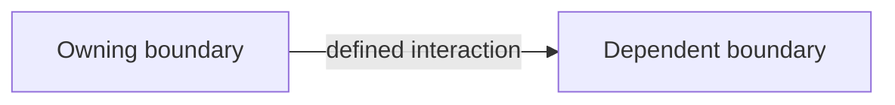

# ADR Format

ADRs live in `docs/adrs/` and use sequential names such as `0001-slug.md`. Scan the directory, then increment the highest number.

Keep records short. The decision and its reason matter more than exhaustive ceremony. Add options, status, or consequences only when they preserve useful context.

When a later decision amends or materially clarifies an ADR, update its current
prose and append a chronological bullet under `## Updates` using
`- YYYY-MM-DDTHH:mm:ssZ: What changed and why.` Use a complete ISO 8601
timestamp with an offset or `Z`. Never rewrite or remove older entries. New
ADRs omit `Updates` until they are amended.

## Required shape

````md
# ADR-NNNN: {Short decision title}

## In brief

- Choose {decision}. Keep {reason}.
- Boundary stays {owner}. No leak.
- Cost: {main trade-off}. Accepted.

## Context

{Why a durable decision is needed.}

## Decision

{The chosen direction, including important exclusions.}



## Updates

- {ISO 8601 timestamp}: {What changed and why.}
````

The `In brief` bullets must use caveman style: terse fragments, exact nouns, explicit `no`, `not`, and `never`. Write all other sections in concise normal prose.

Use the smallest Mermaid diagram that explains a boundary, flow, hierarchy, or state transition. Replace the example with real domain labels. Omit Mermaid only when no diagram would clarify the decision.

## Gate

Always review a PR diff for major architecture, strongly opinionated code, or durable code/product design decisions. A decision qualifies when it establishes or materially changes a durable rule future work must follow, especially:

- ownership or boundaries between OpenBot, Tilde, providers, database, sandbox, web, or desktop
- public protocols, compatibility, authentication, secrets, deployment, or failure policy
- framework, storage, provider, or platform choices with meaningful switching cost
- cross-package layering or a strong coding convention that future maintainers may otherwise undo
- product interaction or visual-system rules applied across multiple flows
- deliberate deviations, non-obvious constraints, or rejected alternatives

Do not create an ADR for routine implementation details, reversible local choices, or a change already governed by an existing ADR. Amend the governing ADR and append a timestamped `Updates` bullet when the durable decision itself changes.

When a qualifying decision appears, summarize it and ask the user one question at a time. Give a recommended answer. Do not invent consent. If the user declines an ADR, preserve that outcome and rationale in the PR body.
