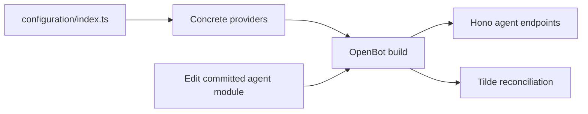

# ADR-0001: Fork-owned repository configuration

## In brief

- Fork owns one `configuration/` tree: agent-scoped resources, provider composition, and provider plugins.
- `configuration/index.ts` explicitly constructs every selected provider.
- Core owns contracts and lifecycle. No layer system.
- Agents are authored directly in the fork. Runtime never generates or publishes source.

## Context

OpenBot must be simple to fork and customize while keeping upstream core changes reusable. Scattered imports or a layer-merging model would obscure ownership and make upgrades harder.

## Decision

`openbot init` creates `configuration/index.ts` inside the one fork-owned `configuration/` tree. The entrypoint calls `Configuration({ providers: { ... } })` with concrete provider instances grouped by domain as `controlService`, `agentService`, `agent`, `computer`, `inferenceModel`, `skills`, and `tools`. Provider packages export implementations but no string-to-provider selector factories; changing an implementation is an explicit source change in the fork composition root.

Repository content is always discovered from canonical paths: agents from `configuration/agents/<id>/`, their skills from `configuration/agents/<id>/skills/`, their workspace seeds from `configuration/agents/<id>/sandbox/workspace/`, and custom provider source from `configuration/providers/`. Global `configuration/skills/` and `configuration/sandbox/` directories are unsupported. These paths and the `/api/agents` route prefix are conventions, not `OpenBotConfiguration` options.

Agent directories use the Eve-compatible subset recorded in ADR-0011. Their `agent.ts` default-exports a Tilde `chatKitEndpoint` request handler, while `instructions.ts`, instrumentation, libraries, authored tools, authored skills, and sandbox workspace seeds remain colocated with the agent. OpenBot does not define a second execution SDK or use Eve's loader. Build-time discovery federates these endpoints; deployment registers agent workspaces without overwriting existing persistent files.

OpenBot stores only reconciliation mappings, digests, and leases as Control State. Tilde remains authoritative for registered agents, skills, conversations, tools, and memory; credentials remain in `EnvProvider`.

## Consequences

- Fork changes remain ordinary reviewable source and survive upstream updates.
- Provider selection is statically visible and type-checked without descriptors or runtime string factories.
- New provider kinds require stable interfaces; agent changes wait for review and deployment.

## Updates

- 2026-08-13T11:12:53+02:00: Moved provider selection into generated `configuration/index.ts` with explicit concrete construction and removed descriptor-driven selector factories.
- 2026-08-13T11:20:28+02:00: Grouped concrete implementations under `providers` and made agents, skills, custom provider source, and sandbox resources use fixed file-based conventions instead of configurable paths.
- 2026-08-13T12:27:55+02:00: Replaced flat agent modules with path-identified agent directories modeled on Eve while retaining OpenBot's ChatKit runtime and shared-computer boundary.
- 2026-08-13T13:23:44+02:00: Removed installation-level skill and sandbox configuration; skills and workspace seeds now exist only inside their owning agent directory.
