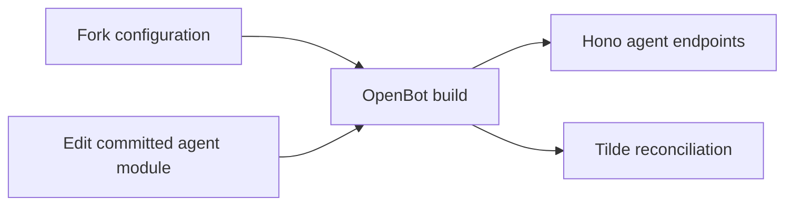

# ADR-0001: Fork-owned repository configuration

## In brief

- Fork owns one `configuration/` tree: agents, runtime skills, sandbox seed, provider plugins.
- Core owns contracts and lifecycle. No layer system.
- Agents are authored directly in the fork. Runtime never generates or publishes source.

## Context

OpenBot must be simple to fork and customize while keeping upstream core changes reusable. Scattered imports or a layer-merging model would obscure ownership and make upgrades harder.

## Decision

`openbot.config.ts` selects providers and paths within one fork-owned `configuration/` tree. Agent modules under `configuration/agents/` are Web-standard route modules: they export `POST`, construct Tilde `chatKitEndpoint` directly, and return Vercel AI SDK responses. OpenBot does not define a second agent SDK, execution wrapper, source generator, or runtime publication API. Build-time discovery federates these endpoints; lease-protected deployment reconciliation registers agents and skills.

OpenBot stores only reconciliation mappings, digests, and leases as Control State. Tilde remains authoritative for registered agents, skills, conversations, tools, and memory; credentials remain in `EnvProvider`.

## Consequences

- Fork changes remain ordinary reviewable source and survive upstream updates.
- New provider kinds require stable interfaces; agent changes wait for review and deployment.
