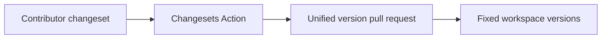

# ADR-0002: Unified Changesets versioning

## In brief

- Changesets records release impact. No second release-note system.
- All workspace packages one fixed group. No independent versions.
- GitHub Action opens version PR. No automatic publish.

## Context

OpenBot is a private-package monorepo whose packages evolve as one product. Independent version drift would imply unsupported compatibility boundaries, while direct version edits would make release intent difficult to review.

## Decision

Changesets manages release notes and package versions. Every workspace package belongs to one fixed group, including private packages for version calculation but not tagging. Contributors add changesets for owner-visible behavior or package API changes. GitHub Actions may create or update a unified version pull request; it does not publish packages.

## Consequences

- One release number describes the complete OpenBot workspace.
- Publishing remains a separate future decision and requires explicit configuration.
