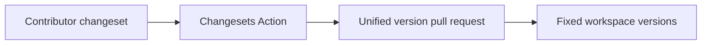

# ADR-0002: Unified Changesets versioning

## In brief

- Changesets records release impact. No second release-note system.
- All workspace packages one fixed group. No independent versions.
- Packages publish publicly. GitHub Action currently opens a version PR only.

## Context

OpenBot is a public-package monorepo whose packages evolve as one product. Independent version drift would imply unsupported compatibility boundaries, while direct version edits would make release intent difficult to review.

## Decision

Changesets manages release notes and package versions. Every workspace package belongs to one fixed group and is configured for public npm publication. Contributors add changesets for owner-visible behavior or package API changes. GitHub Actions may create or update a unified version pull request; the current workflow does not publish packages automatically.

## Consequences

- One release number describes the complete OpenBot workspace.
- Public package artifacts are generated and verified before publication.
- Enabling automatic npm publication remains a separate workflow decision.

## Updates

- 2026-08-13T17:50:21+02:00: Configured every workspace package for public publication and kept automatic publishing outside the current workflow.
- 2026-08-13T18:01:43+02:00: Made native package imports resolve built artifacts while the explicit development condition continues to expose TypeScript sources.
