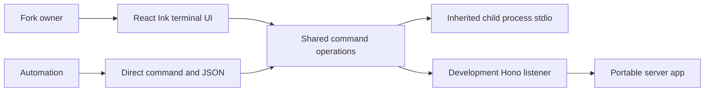

# ADR-0003: React Ink repository CLI

## In brief

- Choose React Ink for human terminal UI. Keep one component model.
- Use Vercel `arg` for command parsing. No hand-rolled flag grammar.
- Root `cli` package owns operator commands and the dev listener. Server never binds.
- Automation stays direct commands plus JSON. No interactive-only operations.
- Long-running child processes keep inherited stdio. Never trap dev or deploy output.

## Context

Fork owners need an approachable setup and operations experience, while scripts and CI need stable non-interactive behavior. Hand-written terminal strings do not provide a coherent interaction model, but a full-screen application must not become a prerequisite for automation or hide delegated process output.

## Decision

The root `cli` workspace package uses React Ink for its interactive launcher, progress feedback, status tables, help, and errors, with Vercel `arg` as the command-line parser. Every operation remains directly callable, structured commands expose `--json`, and non-interactive output remains deterministic. Operator workflows belong in this package; build-only repository helpers may remain under `scripts/`.

The `dev` command supervises the watched Hono application, Vite, and optional Electron shell. There is no separate public `local` command. `apps/control-service` exports the Web-standard application but never owns a port or process lifecycle. Commands that delegate to validation scripts briefly render startup feedback and then hand the terminal to the child process with inherited standard streams.

