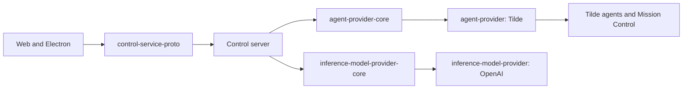

# ADR-0004: Domain-owned provider packages

> Superseded for application wiring by ADR-0005. Domain packages remain, but the UX-first reset does not wire them into the server.

## In brief

- Split provider contracts by domain. No universal provider SDK.
- Keep providers TypeScript-internal. RPC belongs to service-proto packages.
- Agent provider owns agents and sessions. Control methods are not agent tools.
- Remove the legacy universal protocol package after its consumers migrate to domain service protos.

## Context

The original `provider-sdk`, `providers`, and `contracts` packages put unrelated
application boundaries and RPC messages behind one abstraction. That suggests
every provider is remotely callable and couples agent/session behavior to
computer, skills, tools, inference, and environment implementations.

OpenBot needs those boundaries for composition, but most are ordinary
TypeScript interfaces. Only control and computer services need protobuf APIs.

## Decision

Provider contracts and implementations use domain packages. The intended
package shape is:

- `control-service-proto`
- `computer-service-proto`
- `computer-provider-core` and `computer-providers`
- `skills-provider-core` (`SkillProvider`) and `skills-provider`
- `tools-provider-core` (`ToolProvider`) and `tools-provider`
- `agent-provider-core` and `agent-provider`
- `inference-model-provider-core` and `inference-model-provider`

Domain interfaces contain only the operations required at that application
boundary. Provider interfaces and implementations do not expose `health()` or
`verify()` methods unless a future domain requirement explicitly introduces
one. They also do not expose descriptors or generic string selector factories;
`configuration/index.ts` explicitly constructs them, while composition owns
startup validation. Service health endpoints and deployment smoke checks remain
service/runtime concerns rather than provider methods.

The first migration slice adds the control proto plus the agent core and Tilde
implementation. `AgentProvider` owns agent registration and lifecycle as well
as Mission Control session/message operations. The control server translates
that internal interface to ConnectRPC for the web and Electron renderer.
`RegisterAgent` attaches an already implemented endpoint and stores its
one-time credentials; source-level `CreateAgent` continues to open a pull
request under ADR-0001.

Tilde implementations use the Harness SDK. They prefer its high-level domain
clients and use its generated typed API client where a high-level operation is
not available; provider implementations do not call untyped Tilde endpoints
with `fetch`.

Model-facing capabilities are explicit and optional: a provider that needs to
expose AI SDK tools implements `registerTools()`, and a provider that needs to
contribute instructions implements `injectPromptPart()`. Control-plane agent
and session operations are not automatically tools.

Managed skill package assets remain owned by the skills provider. It validates
package paths, sizes, and checksums before writing through a
`SkillAssetDestination`; a computer provider can adapt its file API to that
destination when a skill must execute in an isolated computer. Tilde API keys
and short-lived package download URLs never cross into the computer.

`InferenceModelProvider` returns an AI SDK-compatible model from `model(name)`;
the runtime supplies the model name rather than fixing it in provider
construction. The OpenAI implementation supports Platform API keys and
ChatGPT/Codex OAuth as separate adapters. OAuth acquisition, refresh, and
persistence remain outside inference; the OAuth adapter receives resolved
credentials and applies the account-scoped ChatGPT transport requirements.

The universal `contracts`, `provider-sdk`, and `providers` packages are removed;
their RPC-shaped abstraction is not a compatibility boundary. The active RPC
surfaces live only in `control-service-proto` and `computer-service-proto`.

## Consequences

- Provider code does not imply an RPC surface.
- Agent and session semantics evolve together behind one internal boundary.
- Computer, skills, and tools can migrate without a flag-day change.
- Domain service protos are the only remaining RPC contracts.

## Updates

- 2026-08-13T11:12:53+02:00: Removed universal provider packages plus default descriptor, health, verification, and selector-factory requirements in favor of explicit domain interfaces and composition.
- 2026-08-13T12:09:51+02:00: Removed the unused legacy `contracts` package after control and computer callers moved to their domain service protos.
