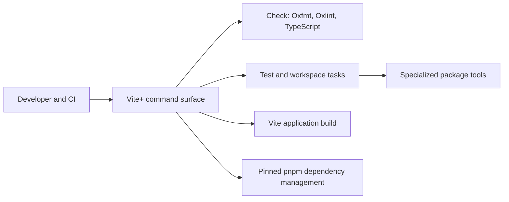

# ADR-0004: Unified Vite+ toolchain

## In brief

- Choose Vite+ for repository tooling. Keep one command surface.
- pnpm stays package manager behind Vite+. No direct task orchestration.
- Generated, vendored, and agent-skill files stay outside formatter ownership. Never create review noise without product value.
- Cost: Vite+ installation and migration lock-in. Accepted.

## Context

OpenBot previously split development tasks across pnpm scripts, Turbo, Vite, Vitest, TypeScript, and package-specific lint aliases. That made `lint` mean type-checking in most packages, provided no repository formatter, and required multiple orchestration paths in local development, CI, deployment, and packaging.

The repository needs one documented command surface that can run consistently across its workspace while retaining package-specific build tools such as tsup and protobuf generation.

## Decision

Vite+ is OpenBot's repository-wide toolchain entry point. `vp check` owns Oxfmt formatting, Oxlint linting, and type-aware TypeScript checks. `vp test`, `vp build`, and `vp run` own test, Vite application build, and workspace task execution. Vite+ delegates dependency management to the pinned pnpm version.

The root `vite.config.ts` is authoritative for shared lint and format policy. Package scripts retain specialized implementation commands when Vite+ does not replace them, including tsup, protobuf generation, Electron packaging, and Playwright. Generated contracts, generated manifests, vendored Beautiful UI files, runtime agent skills, and Markdown are excluded from automatic formatting where reformatting would obscure ownership or provenance.

Turbo is removed. Local development scripts, deployment validation, Vercel commands, Git hooks, editor settings, and GitHub Actions use the `vp` command surface.

## Consequences

- Contributors use one command vocabulary locally and in automation.
- New lint and formatter policy belongs in the root Vite+ configuration.
- Vite+ upgrades must preserve the pinned Vite/Vitest workspace overrides and pass the complete OpenBot validation pipeline.
