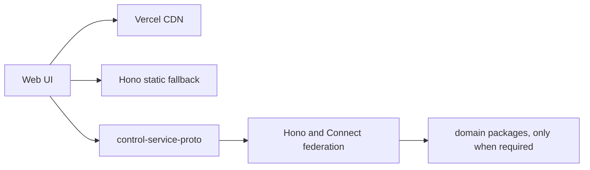

# ADR-0005: UX-first application reset

## In brief

- Design the user experience first, then add the control API it requires.
- Keep the deployed application healthy while functionality is rebuilt.
- Do not wire domain providers into the server until a UX/API need exists.
- Remove the setup-code gate and legacy universal provider packages.
- Vercel CDN serves static files. Hono serves the same build everywhere else.

## Context

The application had accumulated server, RPC, provider, deployment, and setup behavior from several stacked implementation layers. That made provider abstractions drive the product surface before the user experience and owner-facing API were settled.

## Decision

Reset the application layer to a static UX shell and a bare Hono server. The server exposes `/healthz`, federates generated Connect handlers under `/rpc`, and leaves APIs that have not been designed unimplemented. `control-service-proto` remains empty until the UX identifies a required owner-facing operation.

Build the web app once into `apps/web/dist`. Stage that output in Vercel's `public/` directory so production static assets use its CDN. Keep static-file and SPA fallback handling in Hono as the portable default for local and non-Vercel Node.js hosts. Vercel routing configuration must not duplicate the application route table.

Delete the legacy `providers` and `provider-sdk` packages. Preserve the domain packages without wiring them into `apps/server`. Remove setup-code generation, unlock endpoints, browser setup screens, and production setup-secret provisioning.

## Consequences

- Vercel and local Hono runs serve a healthy but intentionally disconnected product shell.
- Vercel accelerates exact static files; Hono remains the portable SPA fallback and API router.
- New functionality starts with a visible UX and an explicit control contract.
- Existing lower-level packages can be evaluated independently in later changes.
- Removed application behavior can be recovered from Git history if needed.
