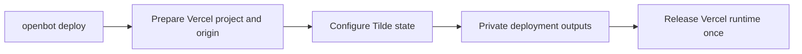

# ADR-0006: Phased provider deployment

## In brief

- One `openbot deploy`. Coordinator calls providers.
- One owner per deployable unit. Shared vendor means no duplicate deploy.
- Order: prepare, configure, release. Stable origin breaks cycle.
- Outputs stay in memory. Secret values never reported.

## Context

OpenBot can use Vercel and Tilde through several domain providers. Calling deploy once per adapter would repeat shared platform work. Deploying the runtime first also appears circular when Tilde needs its public endpoint while the runtime later needs Tilde outputs.

## Decision

Every provider contract extends an optional asynchronous `deploy()` hook. Composition registers only deployment owners: one runtime provider for the Vercel application and, when added, one Tilde state provider for shared Tilde resources. Merely using the same vendor does not make each domain adapter a deployment owner. The CLI invokes all registered owners through one command and deduplicates their deployment IDs.

Do not adopt a general infrastructure state engine yet. Alchemy has the right resource/output/reconciliation model, but currently has no built-in Vercel or Tilde providers; adopting it now would require two custom providers plus a second state and credential lifecycle. Reconsider it if OpenBot moves to an Alchemy-supported runtime or acquires enough durable infrastructure to need plan, drift reconciliation, and destroy.

The coordinator calls owners in three phases. `prepare` establishes stable identities and public origins without releasing application code. `configure` lets dependent providers apply state and place private outputs into shared in-memory deployment outputs. `release` writes contributed runtime environment values through provider-native secret input and deploys the application once. For Vercel and Tilde, Vercel prepares the project and stable production origin, Tilde configures resources against that origin, then Vercel installs Tilde outputs and performs one production release.

## Consequences

- Operators never sequence provider deploy commands themselves.
- Cross-provider dependencies use named outputs instead of redeployment loops.
- A provider can ignore phases it does not own.
- Tilde state deployment remains a later participant; this change implements the Vercel runtime owner first.
