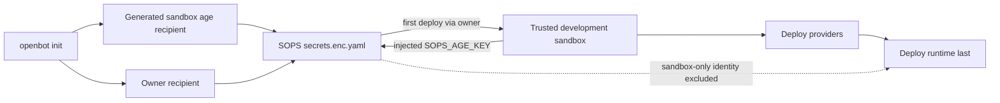

# ADR-0007: SOPS bootstrap and provider initialization

## In brief

- Choose age for sandbox automation. No PGP bootstrap.
- Two SOPS recipients, one group. Sandbox age or owner identity decrypts.
- Owner prefers Vault or cloud KMS. 1Password and native keychain remain local fallbacks.
- Sandbox private identity lives encrypted at `openbot.sandbox.sops_age_key`.
- First deploy uses owner authority. Trusted development sandbox receives `SOPS_AGE_KEY`.
- Provider questions stay declarative. Ink and browser renderers own presentation.
- Deployment credentials reach providers and sandbox. Never final runtime.
- Sandbox-only secrets never reach final runtime environment.

## Context

OpenBot must be able to run and mutate its complete development setup inside a sandbox, then deploy providers and the final runtime. That sandbox needs deployment credentials and a durable way to decrypt repository secrets after its first creation. Encrypting its private identity only to itself would create a bootstrap cycle, while giving every agent computer the identity would collapse the control and computer trust boundaries.

Provider setup also needs interactive input, but provider packages must not depend on Ink because the same onboarding will later be renderable in the web application.

## Decision

`openbot init` creates `configuration/.env` first, then generates an X25519 age identity dedicated to the trusted development sandbox. Age is smaller and easier to automate safely than a generated PGP identity. The owner selects a second independent recipient: HashiCorp Vault Transit, Azure Key Vault, Google Cloud KMS, AWS KMS, a generated age identity stored in 1Password, or a generated age identity stored in the operating system keychain.

Both recipients occupy the same SOPS key group, so either can decrypt. Threshold key groups are not used. The sandbox private identity is stored only inside `configuration/secrets.enc.yaml` at `openbot.sandbox.sops_age_key`. On the first deployment, the owner recipient decrypts that file. The sandbox deployment participant consumes the value through the sandbox-only deployment secret channel and installs it as `SOPS_AGE_KEY`. Later deployments running inside that trusted sandbox can decrypt the same file directly.

The trusted development sandbox is a deployment controller and secret-bearing boundary. Ordinary OpenBot Computers created for agents never receive the SOPS identity. Deployment credentials such as `VERCEL_TOKEN` are a separate secret class: deployment participants and the trusted sandbox can use them, but the final runtime does not install them. Runtime application secrets remain separate, and runtime providers receive them without receiving sandbox-only secrets. Init generates `OPENBOT_COMPUTER_SERVICE_API_KEY` as one static runtime secret. Control, agent, and computer services receive the same key through secret installation; provider deployment outputs never contain it.

Providers may expose serializable initialization metadata: label, description, questions, validation, choices, and a destination mapping to either `.env` or encrypted secrets. Providers do not expose terminal components or browser components. The CLI renders that schema with Ink; a later browser flow can render the same schema.

Plaintext sent to SOPS stays in memory. The CLI uses a private named pipe for SOPS versions that require an input filename; the FIFO contains no stored file data. Generated owner age identities are passed to 1Password or native keychain commands over standard input, never command arguments.

An explicitly selected AWS profile is stored as non-secret OpenBot owner metadata rather than as SOPS `aws_profile` configuration. Before every owner-side SOPS operation, the CLI asks AWS CLI to refresh and export that profile's temporary credentials, then passes them to SOPS only through the child-process environment. This avoids SOPS selecting an expired cached IAM Identity Center session while preserving the profile choice across init, decrypt, and secret mutation.

## Consequences

- Loss of the sandbox does not lose owner access to repository secrets.
- Compromise of the trusted sandbox exposes this installation's secrets and deployment authority; use a unique age identity per installation.
- Changing recipients remains an owner maintenance operation using `sops updatekeys` and, after compromise, `sops rotate`.
- 1Password secret references and native-keychain metadata are non-secret and may be committed; private identities are not.
- The computer provider owns trusted sandbox creation, source placement, and root-only environment installation.

## Updates

- 2026-08-13T12:53:05+02:00: Implemented the trusted development sandbox as a sandbox-role deployment participant that seeds repository source once, installs the aggregate deployment environment with mode `0600`, verifies SOPS decryption, and remains separate from ordinary agent workspaces.
- 2026-08-13T14:49:44+02:00: Added a SOPS-generated static computer-service API key shared only with control, agent, and computer runtimes; computer RPC authorization validates that exact bearer key, and model-controlled Linux processes start with a clean allowlisted environment that excludes it.
- 2026-08-13T18:10:37+02:00: Routed selected AWS profiles through AWS CLI credential refresh and ephemeral SOPS process environments instead of SOPS `aws_profile`, which could select an expired cached SSO session.
