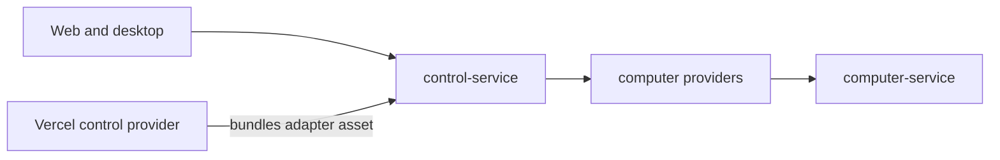

# ADR-0009: Service names and one computer API

## In brief

- Name application packages after the service they own.
- `apps/control-service` owns the owner-facing Hono and Connect service.
- `apps/computer-service` is the only API running inside an OpenBot Computer.
- Remove the legacy `box-host` package and `BoxService` protocol.
- Keep Vercel-specific control adapters in `control-service-provider`, not the portable application or repository root.

## Context

The repository carried both a legacy `apps/box-host` RPC from `packages/contracts`
and the newer `apps/computer-service` backed by `computer-service-proto`. They
overlapped on process, file, screenshot, input, and port operations. The newer
service also owns lifecycle bundles and the VNC tunnel, so renaming both would
leave two competing computer APIs.

The owner-facing application was also named `apps/server`, which described its
transport rather than its domain, and contained a Vercel-only fetch wrapper.

## Decision

Rename `apps/server` and `@tryopenbot/server` to `apps/control-service` and
`@tryopenbot/control-service`. Keep its Hono app and local Node entrypoint portable.
The Vercel control provider owns the Web fetch adapter as a typed asset and
bundles it as part of its prebuilt artifact lifecycle.

Keep `apps/computer-service` and `computer-service-proto` as the single computer
RPC boundary. Delete `apps/box-host`, `BoxService`, and `BoxHealth*` rather than
renaming them into a collision. Existing shared legacy messages remain until
their remaining consumers migrate. The shared computer image compiles this
service in a multi-stage container build; providers never copy a host-built
`dist` file into the image. Remove the obsolete legacy contracts package after
the remaining consumers use `computer-service-proto`.

## Consequences

- Package names identify domain ownership instead of generic hosting roles.
- There is one API-key-protected computer API and one generated computer contract.
- Control-service source and the repository root contain no platform-specific Vercel entrypoint.
- Removing the private legacy RPC is intentionally breaking for untracked consumers.

## Updates

- 2026-08-13T11:12:53+02:00: Required the shared computer image to compile the sole computer service in a multi-stage container build instead of copying a host-built bundle.
- 2026-08-13T12:09:51+02:00: Removed the obsolete legacy contracts package after `computer-service-proto` became the only computer RPC contract.
- 2026-08-13T17:33:29+02:00: Renamed the private workspace package scope from `@openbot` to `@tryopenbot` while retaining the `openbot` CLI command.
