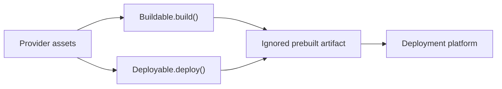

# ADR-0010: Provider-owned deployment assets

## In brief

- Do not track deployment-platform configuration such as a root `vercel.json`.
- Providers own generated source, configuration, and service files as Handlebars templates under `assets/`.
- A provider with several responsibilities uses `<provider>/index.ts` and cohesive subfiles.
- Build and deploy lifecycles render provider assets into ignored artifacts through one strict Handlebars boundary.
- Runtime state and user-supplied file bytes stay byte-preserving data. No template pass.

## Context

Provider implementations produced complete TypeScript entrypoints, JSON configuration, systemd units, and launchd plists from multiline string literals. That hid syntax from its native tooling, made reviews harder, and left a repository-root `vercel.json` coupled to one deployment target even though control and agent services deploy independently.

## Decision

Small providers may remain in `src/<provider>.ts`. Once a provider owns multiple lifecycle responsibilities or runtime files, it moves to `src/<provider>/index.ts`, focused sibling modules, and `src/<provider>/assets/`. Generated-file sources use the target extension followed by `.hbs` and are resolved relative to `import.meta.url`.

`Buildable.build()` bundles executable assets and renders configuration into an ignored deployment artifact. `Deployable.deploy()` renders project configuration that is only needed to invoke the platform. Both use the file-template utilities exported by `@trytilde/dispatch-utilities`, whose strict Handlebars compilation rejects missing values. Values are escaped for their target format before rendering; deliberately pre-encoded fragments use triple braces. Complete files are not stored in TypeScript strings, rendered by ad hoc replacement functions, or copied directly from provider assets.

For Vercel prebuilt deployments, each service provider owns an `assets/vercel.json.hbs`, Function entrypoints, Function configuration, and Build Output configuration as Handlebars assets. The build emits `.vercel/output/config.json`, which owns prebuilt routing. The deploy lifecycle renders `vercel.json` to that service's artifact root immediately before invoking Vercel. No root `vercel.json` is tracked.

Microsandbox and Vercel Sandbox use the same computer filesystem and startup
contract, so `computer-service-provider` owns one shared image under
`src/base/assets/`. Its build lifecycle stages only the required workspace
sources into an ignored Docker context and renders the shared `.hbs` assets
there. The multi-stage Containerfile compiles
`apps/computer-service` inside that context and copies the resulting bundle into
the runtime stage. Provider-specific asset directories are added only if an
adapter diverges from this complete shared image.

## Consequences

- Editors, formatters, and reviewers see the actual generated file formats.
- Control and agent services carry independent platform configuration.
- Provider packages must explicitly render or bundle every required asset and test the materialized artifact.
- Generated source, configuration, service, deployment, and provider assets share one strict rendering implementation.
- Runtime persistence, database contents, lifecycle bundle bytes, and user-supplied file contents are not templates and remain byte preserving.
- A computer image build is reproducible from staged source and never consumes a host-built service bundle.

## Updates

- 2026-08-13T11:12:53+02:00: Standardized generated source, configuration, service, deployment, and provider assets on strict Handlebars templates while keeping runtime persistence and user file bytes byte preserving.
- 2026-08-13T12:09:51+02:00: Moved file-template helpers into the shared `@dispatch/utilities` package so future cross-domain utilities have one neutral home.
- 2026-08-13T17:33:29+02:00: Renamed the private workspace package scope from `@dispatch` to `@trytilde/dispatch-*`; provider asset ownership and lifecycle boundaries are unchanged.
- 2026-08-17T20:05:00+02:00: Renamed the Computer lifecycle and image owner to `@trytilde/dispatch-computer-service-provider`; asset ownership and rendering behavior are unchanged.
