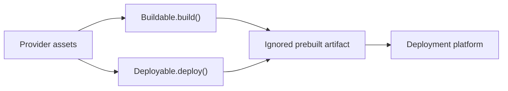

# ADR-0010: Provider-owned deployment assets

## In brief

- Do not track deployment-platform configuration such as a root `vercel.json`.
- Providers own their static source, configuration, and service templates as real files under `assets/`.
- A provider with several responsibilities uses `<provider>/index.ts` and cohesive subfiles.
- Build lifecycles bundle or copy assets into ignored artifacts; deploy lifecycles materialize deploy-time project configuration.
- Dynamic generation renders only values and fragments into provider-owned templates.

## Context

Provider implementations produced complete TypeScript entrypoints, JSON configuration, systemd units, and launchd plists from multiline string literals. That hid syntax from its native tooling, made reviews harder, and left a repository-root `vercel.json` coupled to one deployment target even though control and agent services deploy independently.

## Decision

Small providers may remain in `src/<provider>.ts`. Once a provider owns multiple lifecycle responsibilities or runtime files, it moves to `src/<provider>/index.ts`, focused sibling modules, and `src/<provider>/assets/`. Static runtime files use their real extension and are resolved relative to `import.meta.url`.

`Buildable.build()` bundles executable assets and copies static configuration into an ignored deployment artifact. `Deployable.deploy()` materializes project configuration that is only needed to invoke the platform. Dynamic values may be escaped and inserted into explicit placeholders; complete files are not stored in TypeScript strings.

For Vercel prebuilt deployments, each service provider owns an `assets/vercel.json`, Function entrypoints, Function configuration, and Build Output configuration. The build emits `.vercel/output/config.json`, which owns prebuilt routing. The deploy lifecycle copies `vercel.json` to that service's artifact root immediately before invoking Vercel. No root `vercel.json` is tracked.

## Consequences

- Editors, formatters, and reviewers see the actual generated file formats.
- Control and agent services carry independent platform configuration.
- Provider packages must explicitly copy or bundle every required asset and test the materialized artifact.
- Runtime-generated data such as environment values remains code-generated because it is not a static file template.
