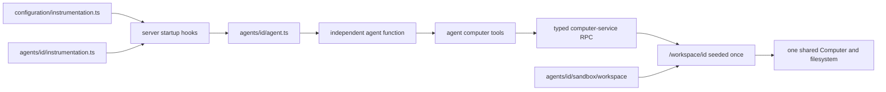

# ADR-0011: Eve-compatible agent layout

## In brief

- Agent is `configuration/agents/<id>/`. Path owns identity.
- Keep Eve-shaped authored slots where useful. No Eve runtime or loader.
- `agent.ts` default-exports `chatKitEndpoint`. `instructions.ts` feeds its system prompt.
- One shared computer, filesystem, and process identity. Each populated agent seed gets `/workspace/<id>`.
- Seed workspace once. Never overwrite deployed agent files implicitly.
- Keep Eve's authored `sandbox/` folder and familiar tool names; use computer terminology elsewhere.
- Scaffold explicit typed computer tools whose shared implementations live in computer-provider.

## Context

OpenBot needs a predictable, portable authored-agent layout without inventing vocabulary that already exists in Vercel's Eve SDK. Eve's filesystem model is a useful convention, but OpenBot uses Tilde ChatKit endpoints, its own provider composition, one shared computer, and independently built local or Vercel agent-service artifacts. Blind Eve compatibility would therefore promise runtime behavior OpenBot does not have.

## Decision

Each agent lives under `configuration/agents/<id>/`; the directory name is its ID. OpenBot supports this authored subset:

```text
configuration/
├── instrumentation.ts
└── agents/<id>/
    ├── agent.ts
    ├── instructions.ts
    ├── instrumentation.ts
    ├── lib/
    ├── tools/
    ├── skills/
    └── sandbox/workspace/**
```

`agent.ts` is required and default-exports the request handler returned by Tilde `chatKitEndpoint(...)`. `instructions.ts` is required, default-exports the system instructions, and is imported explicitly by `agent.ts`. OpenBot does not support `instructions.md`.

The optional instrumentation files use Eve's `defineInstrumentation({ setup })` authoring shape. `configuration/instrumentation.ts` runs first for every agent at server startup; an optional agent-local `instrumentation.ts` runs second; only then does OpenBot import `agent.ts`. OpenBot supplies the resolved path-derived `agentName`. Instrumentation is a server startup hook, not an agent tool.

Every file under `tools/` default-exports a Vercel AI SDK tool. Every skill is a spec-conformant Markdown file or skill package. `lib/` is ordinary import-only TypeScript. Skills remain authored structure without automatic loading. Tools are explicitly imported by `agent.ts`; OpenBot does not use a directory loader. Channels, connections, hooks, schedules, and subagents are not supported.

OpenBot terminology calls the runtime a Computer, so new APIs, environment variables, and provider contracts use `computer`. The authored `sandbox/workspace/**` path and familiar model-facing tool names are deliberate compatibility exceptions that keep OpenBot agent repositories structurally familiar without changing the shared-computer model.

Every agent explicitly contains `await_shell.ts`, `bash.ts`, `copy_from_computer.ts`, `copy_to_computer.ts`, `read_file.ts`, `write_file.ts`, `glob.ts`, `grep.ts`, and `screenshot.ts`. Each file is a thin default export from `@openbot/computer-provider/tools` with the path-derived agent ID fixed outside its model-visible schema. Computer-provider owns the reusable Vercel AI SDK tools and Zod schemas; computer-service-proto remains transport-only. Agent code does not call Microsandbox, Vercel Sandbox, or an untyped HTTP endpoint directly. The API-key-protected computer-service validates the request and uses the fixed agent ID to select `/workspace/<id>` as the default directory and to scope durable background-job handles.

Bash tools invoke `bash -lc` with `HOME=/workspace/<id>`, making the agent's
directory the login-shell home. Init scaffolds `sandbox/workspace/.profile` so
every Bash command has one deterministic startup file; that profile may source
an optional `.bashrc`. The profile contains no secrets and follows the same
one-time seed semantics as every other authored workspace file.

OpenBot does not reproduce Eve's one-sandbox-per-agent model. One OpenBot Computer, filesystem, and service process identity are shared by all agents. When an agent has authored workspace seed files, deployment creates `/workspace/<id>` and copies them there. Commands and relative file paths default to that directory, while absolute paths can address the wider machine. Agent IDs provide routing context, not filesystem isolation: agents can inspect or modify sibling directories and administer the shared machine subject to the computer process's operating-system privileges.

Files from `configuration/agents/<id>/sandbox/workspace/**` are copied only when the populated agent directory is first seeded. Empty seed trees do not create `/workspace/<id>`. Ordinary later agent deployments detect the marker and leave the persistent directory untouched. Consequently, edits to authored workspace seeds do not appear for already deployed agents; applying them requires a future explicit workspace reconciliation or destructive computer replacement operation.

Agent-service discovery, checking, content digests, local federation, and parallel Vercel function builds use `agent.ts` inside each directory as the entrypoint. OpenBot follows Eve's layout where possible, but it does not load these folders with Eve and does not claim behavioral compatibility.



## Consequences

- Fork authors get a familiar Eve-shaped tree without coupling OpenBot deployment to Eve.
- Each agent remains an independently compiled function entrypoint.
- Required computer tools are explicit; arbitrary tools and skills remain author-controlled.
- Persistent agent workspaces are protected from silent seed overwrites.
- Desktop, compute, process identity, and filesystem access are installation-wide; `/workspace/<id>` is a convention, not a security boundary.
- The Eve-compatible authored folder and default tools retain Eve names; runtime and API language says `computer`.

## Updates

- 2026-08-13T12:53:05+02:00: Strengthened agent filesystem isolation from path translation alone to a private bind-mounted `/workspace` plus Linux-user execution.
- 2026-08-13T14:29:49+02:00: Kept `sandbox/workspace` solely for Eve layout compatibility, required one typed computer tool file per supported operation, and moved agent-to-user execution enforcement into computer-service.
- 2026-08-13T14:49:44+02:00: Standardized required scaffolding on Eve's `bash`, `read_file`, `write_file`, `glob`, and `grep`; each tool fixes its agent ID outside model input and routes through computer-service.
- 2026-08-13T15:19:48+02:00: Standardized agent Bash commands on login-shell startup and scaffolded a one-time workspace `.profile` that may source `.bashrc`.
- 2026-08-13T15:36:39+02:00: Made `openbot new-agent` the canonical agent scaffolder, reused it from init, centralized standard tool implementations in computer-provider, and removed the redundant hello-world tool.
- 2026-08-13T15:41:25+02:00: Replaced per-agent Linux users and mount namespaces with one shared filesystem; populated seeds now initialize `/workspace/<agent-id>` and commands default there without treating it as a security boundary.
- 2026-08-13T16:42:00+02:00: Added explicit copy-to, copy-from, screenshot, background-shell, and await-shell scaffolding with Zod schemas; background job state now survives computer-service restarts on the Computer's persistent disk.
