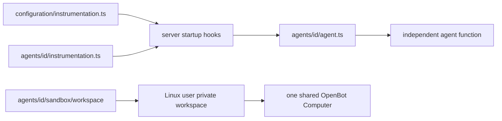

# ADR-0011: Eve-compatible agent layout

## In brief

- Agent is `configuration/agents/<id>/`. Path owns identity.
- Keep Eve-shaped authored slots where useful. No Eve runtime or loader.
- `agent.ts` default-exports `chatKitEndpoint`. `instructions.ts` feeds its system prompt.
- One shared computer. One Linux user and private persistent workspace per agent.
- Seed workspace once. Never overwrite deployed agent files implicitly.

## Context

OpenBot needs a predictable, portable authored-agent layout without inventing vocabulary that already exists in Vercel's Eve SDK. Eve's filesystem model is a useful convention, but OpenBot uses Tilde ChatKit endpoints, its own provider composition, one shared computer, and independently built local or Vercel agent-service artifacts. Blind Eve compatibility would therefore promise runtime behavior OpenBot does not have.

## Decision

Each agent lives under `configuration/agents/<id>/`; the directory name is its ID. OpenBot supports this authored subset:

```text
configuration/
├── instrumentation.ts
└── agents/<id>/
    ├── agent.ts
    ├── instructions.ts
    ├── instrumentation.ts
    ├── lib/
    ├── tools/
    ├── skills/
    └── sandbox/workspace/**
```

`agent.ts` is required and default-exports the request handler returned by Tilde `chatKitEndpoint(...)`. `instructions.ts` is required, default-exports the system instructions, and is imported explicitly by `agent.ts`. OpenBot does not support `instructions.md`.

The optional instrumentation files use Eve's `defineInstrumentation({ setup })` authoring shape. `configuration/instrumentation.ts` runs first for every agent at server startup; an optional agent-local `instrumentation.ts` runs second; only then does OpenBot import `agent.ts`. OpenBot supplies the resolved path-derived `agentName`. Instrumentation is a server startup hook, not an agent tool.

Every file under `tools/` default-exports a Vercel AI SDK tool. Every skill is a spec-conformant Markdown file or skill package. `lib/` is ordinary import-only TypeScript. These slots are intentionally inert for now: the OpenBot build preserves and checks their structure but does not auto-register tools or skills. Channels, connections, hooks, schedules, and subagents are not supported.

OpenBot does not reproduce Eve's one-sandbox-per-agent model. One OpenBot Computer is shared by all agents. Agent deployment registers a stable Linux user for each agent and allocates `/workspace/.openbot/agents/<id>/workspace` on the persistent disk. Provider calls scoped to that agent enter a private mount namespace, bind that agent's physical directory over logical `/workspace`, and then execute as its Linux user. The backing workspace tree is mode `0700`, and another agent's physical path is not reachable through its logical workspace view.

Files from `configuration/agents/<id>/sandbox/workspace/**` are copied only when the Linux user and workspace are first registered. Ordinary later agent deployments detect the registration marker and leave the persistent workspace untouched. Consequently, edits to authored workspace seeds do not appear for already deployed agents; applying them requires a future explicit workspace reconciliation or destructive computer replacement operation.

Agent-service discovery, checking, content digests, local federation, and parallel Vercel function builds use `agent.ts` inside each directory as the entrypoint. OpenBot follows Eve's layout where possible, but it does not load these folders with Eve and does not claim behavioral compatibility.



## Consequences

- Fork authors get a familiar Eve-shaped tree without coupling OpenBot deployment to Eve.
- Each agent remains an independently compiled function entrypoint.
- Tools and skills can exist before their loading semantics are designed.
- Persistent agent workspaces are protected from silent seed overwrites.
- Shared desktop and compute resources remain installation-wide; filesystem identity is per agent.

## Updates

- 2026-08-13T12:53:05+02:00: Strengthened agent filesystem isolation from path translation alone to a private bind-mounted `/workspace` plus Linux-user execution.
