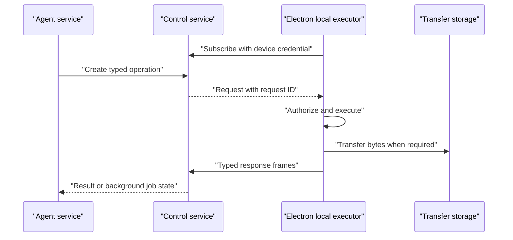

# ADR-0012: User desktop execution channel

## In brief

- Desktop opens outbound channel. No inbound desktop port.
- Control service owns rendezvous, device authority, and durable request state.
- Agent service submits typed operations. No direct agent-to-desktop connection.
- Connect server stream carries requests. Unary RPCs carry acknowledgements and responses.
- Large file bytes bypass control service after authorization.
- Status: accepted design, unimplemented.

## Context

Deployed agents will need optional access to the user's actual computer for approved shell execution, screenshots, and explicit file transfer. Electron normally runs behind NAT and must not expose an internet-facing local service. Independently deployed agent functions are also the wrong owner for device registration, revocation, permissions, and durable request correlation.

A direct connection from every agent entrypoint to Electron would save one network hop, but it would duplicate device authority across deployments, couple desktop connections to agent redeployments, and still fail to provide shared in-memory channel state on a serverless platform.

## Decision

The control service is the rendezvous and authorization boundary for user-desktop operations. The Electron main process will supervise a local executor and establish an authenticated outbound subscription to the control service. The renderer receives no direct filesystem, process, or network authority.

The typed service contract will provide a server-streaming request subscription rather than relying on a bidirectional connection. Each request carries a unique request ID, agent ID, device ID, expiry, approval description, and a typed operation. Separate unary RPCs acknowledge requests and submit typed response or failure frames correlated by request ID. Initial operations are expected to include desktop shell execution, awaiting background shell jobs, screenshots, copying to the user's computer, and copying from the user's computer.

The control service will persist queued requests, responses, expiry, and delivery state. An open stream is only a notification and delivery mechanism; correctness must not depend on an agent request and desktop subscription reaching the same process. The desktop uses a revocable per-device credential. Computer-service credentials and agent credentials do not grant user-desktop authority.

The local executor applies the user's desktop permission policy before every protected operation and constrains filesystem access to the approved request. Agent tools fix their agent identity outside model-visible schemas. They submit operations to the control service and never address Electron directly.

Large file transfers use the control service for authorization and completion state, but transfer bytes through short-lived signed upload or download locations. This keeps bulk data out of control-service function memory and RPC message limits. A dedicated relay may later replace the channel transport for latency or scale while preserving this contract and the control service's authority.

## Consequences

- Electron requires no inbound public listener; all remote connectivity is outbound.
- Device authorization, revocation, delivery, and auditing have one owner.
- One additional regional request hop is accepted to avoid coupling devices to independently deployed agent functions.
- Vercel deployment requires a durable queue or state store; an in-memory subscriber registry is insufficient.
- Shell execution needs background job IDs and an await operation so agent requests do not hold serverless functions indefinitely.
- Screenshot and file operations need explicit limits, expiry, cancellation, and permission records.
- No service, RPC, durable state, Electron executor, permission UI, or agent tool described here has been implemented yet.
