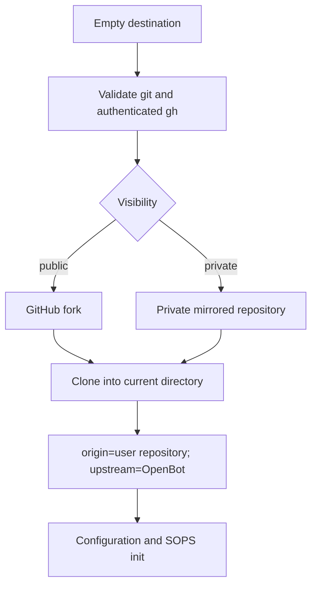
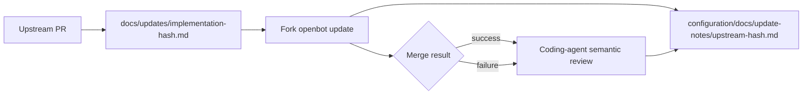

# ADR-0013: Repository bootstrap and fork updates

## In brief

- Init owns GitHub repository bootstrap. Empty directory only. No partial in-place setup.
- Public means GitHub fork. Private means independent mirror. Never claim private fork-network membership.
- Every upstream PR ships caveman update metadata. No undocumented fork impact.
- `openbot update` merges upstream, then hands review to coding agent. Never declare fork behavior preserved automatically.
- Future code-forge provider replaces direct `gh` orchestration. Manual GitHub flow is temporary.

## Context

OpenBot is designed to be customized in a user-owned repository. The current `pnpm openbot init` assumes the repository already exists, which leaves repository ownership, visibility, upstream remotes, and future upgrades as manual steps. Private GitHub repositories cannot be members of the public upstream's fork network, so public and private bootstrap paths are necessarily different.

Forks may change any package and cannot safely consume upstream releases from a package boundary alone. Upstream changes therefore need durable, machine-readable-enough human guidance, and updating a fork must explicitly hand semantic verification to the user's coding agent.

## Decision

### Bootstrap an owned repository before configuration

`openbot init` becomes a standalone bootstrap command that runs from the intended, completely empty destination directory. Any entry, including hidden files, makes init fail before prompts or network mutation. The command must be distributable independently of a cloned OpenBot workspace; the existing repository-local `pnpm openbot init` invocation is transitional and cannot implement this decision by itself.

Init checks that `git` and authenticated GitHub CLI access are available. Missing `gh`, failed `gh auth status`, unavailable SSH access, an existing destination repository, or any Git operation failure aborts repository bootstrap and prevents configuration initialization.

The user chooses a repository name and visibility. Visibility defaults to private. The owner defaults to the account reported by the authenticated GitHub CLI; organization selection is a future extension.

- Public: use `gh repo fork` with the requested name, clone it into the current empty directory, and retain the canonical OpenBot repository as `upstream`.
- Private: create a new private GitHub repository, make a temporary bare clone of canonical OpenBot, mirror its refs to the new repository, remove the temporary bare repository, clone the private repository into the current directory, and add canonical OpenBot as `upstream`. This is an independent repository copy, not a GitHub fork.

Temporary mirror state lives in a securely created temporary directory and is always cleaned up. The implementation must not use a predictable repository-local seed directory. `origin` always names the user repository; `upstream` always names canonical OpenBot. Only after clone and remote verification succeed does init continue with SOPS, provider configuration, instrumentation, and initial-agent scaffolding inside the new repository.

The first implementation may invoke `gh` and `git` through typed command-runner boundaries. Follow-up work will introduce a code-forge or `GitProvider` domain and replace these direct GitHub operations with provider calls without changing the bootstrap contract.

That provider follow-up owns forge account discovery, repository creation or fork/mirror provisioning, visibility, clone URLs, default-branch metadata, authentication handoff, and remote configuration. Local Git history and merge mechanics remain CLI/application workflow; the provider must not become a generic filesystem or shell abstraction. GitHub is the first implementation, with other forges added only after their real differences are known.

### Ship one fork-update record with every PR

Every upstream PR that changes repository contents must add `docs/updates/<implementation-commit>.md`. The identifier is the PR head commit immediately before the update-note commit. The update-note-only commit is exempt from recursively requiring another note. Rebasing or amending the implementation invalidates the filename and requires regenerating the note.

Each record is detailed but written in caveman style and contains these exact sections:

1. `Intent of the change`
2. `Architecture changes`, including a Mermaid diagram even when the diagram only confirms an unchanged boundary
3. `Summarized package changes`
4. `Critical to apply to forks`, with exactly `yes` or `no` followed by the reason and required fork action

PR preparation and CI treat a missing, stale-hash, or malformed update record as a blocking defect. These records describe the complete PR rather than individual minor commits. They must contain no secrets, generated deployment state, or fork-specific configuration.

### Update a customized fork and require semantic review

`openbot update` requires a clean worktree, an `upstream` remote pointing to canonical OpenBot, and the user's current branch. It fetches `upstream/main`, identifies the upstream range since the current merge base, and runs a normal merge. Git fast-forwards when possible and creates a merge commit when the fork has diverged. The command does not rebase, force-reset, discard fork commits, auto-resolve conflicts, push, or deploy.

Before attempting the merge, the command always creates `configuration/docs/update-notes/<upstream-head>.md`. Init seeds `configuration/docs/update-notes/README.md` explaining that these are fork-owned verification notes rather than upstream release notes.

- No upstream commits: write exactly `no updates` to the note.
- Merge success: write the upstream range, consumed `docs/updates/` records, merge result, and a pending coding-agent review checklist.
- Merge conflict or other merge failure: retain the note with the attempted range, failure state, discovered update records, and unresolved paths when available.

On both success and failure, the CLI prints a ready-to-copy prompt telling the user to launch their default coding agent, read every upstream update record in the range, inspect the fork's customizations and conflicts, preserve all critical and intended functionality, run appropriate checks, and replace or extend `configuration/docs/update-notes/<upstream-head>.md` with its conclusions. A successful Git merge is never presented as proof that the customized fork still behaves correctly.

A follow-up will automatically launch the user's configured default coding agent with that prompt after writing the update note. Agent detection and invocation must be explicit configuration or a verified installed-agent integration, never a guessed shell command. Automatic launch happens for success, conflict, and no-update results; an unavailable or failed coding-agent launch is non-destructive, leaves the note intact, and falls back to printing the complete prompt and manual command. The CLI never grants extra permissions, bypasses the agent's approval model, or treats process launch as completed review.

## Consequences

- Fresh users receive a repository they own before any credentials or fork configuration exist.
- Public repositories preserve GitHub fork relationships; private repositories sacrifice fork-network metadata for actual privacy.
- The CLI needs an independently installable bootstrap distribution before this init flow can replace repository-local initialization.
- Update notes add one mechanical PR commit and must be regenerated after history rewriting.
- Merge automation handles Git history only. Coding-agent review owns semantic preservation of arbitrary fork customizations.
- Direct GitHub CLI orchestration is accepted temporary coupling until the code-forge provider exists.

## Updates

- 2026-08-13T16:59:19+02:00: Added follow-up boundaries for a forge-specific repository provider and automatic default coding-agent launch after every update result, with safe manual fallback and no implied review completion.
