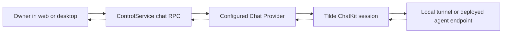

# ADR-0014: Owner chat through the control service

## In brief

- Web and desktop chat through ConnectRPC on the control service.
- Control handlers delegate conversation ownership to the configured Chat Provider.
- Local HMR and deployed control artifacts load the same fork-owned provider composition.
- Agent execution remains behind the independently deployed agent endpoint.

## Context

Tilde owns agents, ChatKit sessions, messages, and agent execution, while OpenBot owns the
owner-facing workspace. The original reset shell had no chat transport, so a running or deployed
installation could provision an agent without letting its owner converse with it.

## Decision

`ControlService` exposes narrow RPCs to list agents, create a session, list messages, and send a
message. The control service maps these operations to `ChatProvider`; it does not persist a second
copy of conversation state. The browser calls the same-origin `/rpc` namespace, so Vite's local
proxy, the packaged desktop proxy, and the deployed Vercel control Function share one contract.

Both local development and generated control-service deployment entries construct the Hono app
with `configuration.providers.chat`. Agent responses still execute through the provider-managed
agent endpoint, whether that endpoint is a development tunnel or the deployed agent service.

## Consequences

- Conversation state remains authoritative in the Tilde Team.
- Control deployments must bundle the fork-owned configuration composition.
- Provider failures cross the control boundary as Connect error codes.
- Streaming and richer ChatKit parts can extend this contract without exposing provider APIs to the browser.
