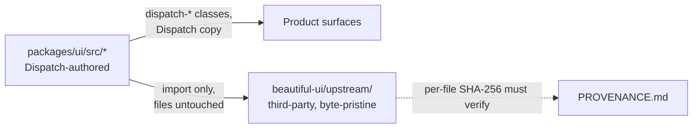

# ADR-0021: Dispatch-owned UI naming and copy

## In brief

- Dispatch-authored UI owns its own names and its own words. No identifier or user-visible string carried from a reference build.
- One class prefix: `dispatch-`. Design tokens `--dispatch-*`, class families `dispatch-*`. No second prefix.
- Exception: CSS generic keywords. `ui-sans-serif` and `ui-monospace` are font values, not classes. Never rewritten.
- Vendored third-party trees stay byte-pristine. Per-file hashes in the tree's `PROVENANCE.md` must verify. Modifications recorded there, never silent.
- No gate catches a violation. Typecheck, lint, and tests stay green either way. Review is the enforcement.
- Cost: a rename touches every consumer selector and every text-matching test. Accepted once, not repeatedly.

## Context

Parts of the workspace UI were reconstructed with a third-party reference build as the visual
target, and the reconstruction carried that build's internal class families (`ui-*`) and its
interface copy through verbatim into Dispatch-authored files. Nothing functional depended on either:
identifiers and user-visible strings are expression, not interface.

The coupling is invisible to every gate the repository runs. `pnpm check`, `pnpm build`, and
`pnpm test` cannot tell `dispatch-markdown__link` from `ui-markdown__link`, or one wording of an aria
label from another. A contributor reconstructing another component, reapplying a stale patch, or
resolving a merge conflict toward the older side reintroduces it with every check green. Rules that
no check enforces decay unless they are written where conventions are looked up.

## Decision

Every Dispatch-authored surface carries Dispatch-authored names and Dispatch-authored wording.

Class families use the `dispatch-` prefix, matching the `--dispatch-*` custom properties already defined in
`packages/ui/src/dispatch-ui.css`. One prefix, one owner. The single exception is CSS generic
font keywords — `ui-sans-serif` and `ui-monospace` are values in the `--font-sans` and `--font-mono`
stacks, not class names, and are never rewritten.

User-visible copy — panel titles, aria labels, status lines, permission dialog text, placeholders —
is written for Dispatch rather than inherited. Account and identity defaults are generic
(`"Your account"`), never a person's name.

Vendored third-party trees are the counterpart rule and move in the opposite direction: files under
`packages/ui/src/beautiful-ui/upstream/` stay byte-pristine, because the per-file SHA-256 values
recorded in that tree's `PROVENANCE.md` are the evidence its license terms were honored. Renaming
inside a vendored tree is prohibited; a genuine modification is recorded in `PROVENANCE.md`, never
made silently.

The explicit no: do not reintroduce reference-build naming or copy when merging upstream,
reapplying local patches, or reconstructing further components.

## Consequences

- A rename is a breaking change for consumers even though no type or symbol changed. Fork
  stylesheets, snapshot tests, and browser locators targeting the old names fail silently.
- No automated guard exists. A scoped grep gate over `packages/ui/src` — excluding
  `beautiful-ui/upstream/`, allowing the two font keywords — folded into `pnpm check` would turn
  this convention into a check. Until then this record is the only thing standing between the
  codebase and a future re-coupling.
- `apps/mobile` maintains a parallel component tree with its own provenance file and has not been
  audited against this rule.

## Updates

- 2026-08-19T09:00:00Z: Recorded retroactively while backfilling PR 49's documentation. The rule was
  applied in full by that PR; only the record is new.
- 2026-09-03T15:03:26+02:00: Renamed the product-owned UI identity to Dispatch, including the
  stylesheet and its class and design-token prefix.
