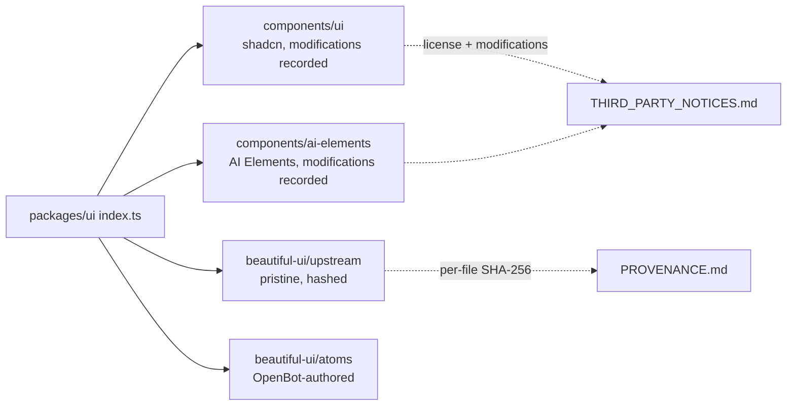

# ADR-0022: Vendored web component sources and provenance

## In brief

- Vendor web components by copy: shadcn/ui, Beautiful UI, AI Elements live in `packages/ui` source. No npm UI-kit dependency.
- `beautiful-ui/upstream/` stays pristine. Every drift recorded in `PROVENANCE.md` against per-file retrieval SHA-256. No unrecorded edit.
- Unpublished upstream primitives are reconstructed in `beautiful-ui/atoms/`, OpenBot-authored. No pretend provenance.
- Licenses and modifications live in `THIRD_PARTY_NOTICES.md`. Kept current on every vendored change.
- shadcn `accent` remaps to `hover`/`ink`; Beautiful UI owns `--color-accent`. No token collision.
- Cost: manual upstream refresh, no automatic updates. Accepted for auditability and offline builds.

## Context

The workspace UI needs a large component surface — primitives, chat elements, streaming markdown —
that no single dependency provides. The candidate sources (shadcn/ui, the Beautiful UI set, Vercel
AI Elements) are distributed as source to be copied rather than as versioned packages, and each
carries its own license.

An earlier vendoring of the Beautiful UI set was taken from a stale third-party mirror, so the
repository held files whose real origin could not be established. That is the failure mode this
decision exists to prevent: vendored code whose provenance nobody can reconstruct is a legal and
maintenance liability, and a future contributor "cleaning up" the tree or converting it to an npm
dependency would erase the evidence entirely.

## Decision

Web components are vendored by copy into `packages/ui` source. There is no npm UI-kit dependency to
upgrade, and builds do not depend on a registry being reachable.

The vendored tree is layered by ownership:

- `beautiful-ui/upstream/` holds files retrieved from the publisher's live published source. It stays
  pristine. Each file's retrieval SHA-256 is recorded in `PROVENANCE.md`, and the only permitted
  drift — an analytics call removed, import paths rewritten — is recorded there too.
- `beautiful-ui/atoms/` holds OpenBot-authored reconstructions of primitives the publisher never
  released as source. They are labeled as OpenBot's own work rather than given borrowed provenance.
- `components/ui/` and `components/ai-elements/` hold shadcn/ui and AI Elements copies, whose
  licenses and modifications are recorded in the root `THIRD_PARTY_NOTICES.md`.

`components.json` pins the shadcn registry configuration so later `shadcn add` pulls land in the same
tree with the same conventions. Where vendored token namespaces collide, the newcomer yields:
shadcn's `accent` utilities are remapped to the `hover` and `ink` tokens because Beautiful UI already
owns `--color-accent`.

## Consequences

- Upstream fixes do not arrive automatically. Refreshing means re-retrieving from published source
  and updating the recorded hashes — deliberate, auditable, and infrequent.
- A fork that edits `upstream/` without recording it in `PROVENANCE.md` destroys the audit trail.
  Fork-authored composition belongs outside `upstream/`.
- Component sourcing and visual tokens have different owners of change; token and theming decisions
  are recorded separately. Naming and copy ownership over these trees is governed by ADR-0021.

## Updates

- 2026-08-19T09:00:00Z: Recorded retroactively while backfilling PR 50's documentation. The strategy
  shipped with that PR; only the record is new.
