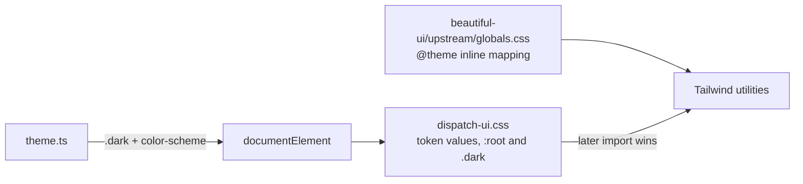

# ADR-0024: Semantic design tokens and class-based theming

## In brief

- Dispatch owns token values. Vendored `globals.css` owns the utility mapping. No edit inside `beautiful-ui/upstream/`.
- Override by import order. `dispatch-ui.css` after `beautiful-ui.css`. Provenance hashes stay valid.
- Tokens are semantic, not chromatic: `--page`, `--canvas`, `--surface`, `--inset`, `--ink`/`-2`/`-3`, `--line`/`--line-strong`, `--hover`/`--hover-2`. No `--grey-400`.
- Hover and selected fills are alpha on grey, not solid greys. They hold on any surface.
- Theming is class-based: `.dark` plus `color-scheme` on `documentElement`, set by `theme.ts`. Never `prefers-color-scheme` alone — a media query cannot express an explicit override.
- Preference is `light` / `dark` / `system`, persisted in one `localStorage` key. Storage failure degrades to `system`. No throw.
- Dark carries elevation with fills and borders. Every shadow token collapses to a hairline. No drop shadow in dark.
- Element resets live in `@layer base`. Unlayered element selectors beat utilities; that defect is silent.
- Every entry point calls `initTheme()` before first paint. Importing the stylesheet alone does nothing.
- Cost: no visual regression gate. Review and manual two-scheme checks are the enforcement. Accepted.

## Context

The vendored Beautiful UI stylesheet already maps every Tailwind utility onto raw custom properties,
so whoever sets those properties owns the product's entire visual identity. That should be Dispatch,
not the vendor — but ADR-0022 requires `beautiful-ui/upstream/` to stay byte-pristine, because its
per-file SHA-256 values are the provenance evidence. Editing the vendored `globals.css` to change a
color would invalidate them.

Three further constraints are load-bearing and invisible from the code:

Theming has to respond to an explicit user preference, which `prefers-color-scheme` cannot express.
Dark mode cannot get elevation from drop shadows, because a shadow is invisible on a near-black
surface. And unlayered element selectors outrank utility classes, so an element reset outside
`@layer base` silently defeats a utility — the defect that produced this rule was a font-size utility
quietly losing to a reset, with nothing failing.

## Decision

Dispatch owns token values; the vendored stylesheet keeps owning the utility mapping. The values are
overridden by import order — `dispatch-ui.css` imported after `beautiful-ui.css` — never by editing
inside `beautiful-ui/upstream/`. That keeps ADR-0022's provenance hashes valid.

Tokens are semantic rather than chromatic. `--page`, `--canvas`, `--surface`, `--inset`, the `--ink`
ramp, `--line`/`--line-strong`, and `--hover`/`--hover-2` describe roles, so retuning the palette is
one file and no component encodes a color. Hover and selected fills are alpha over grey rather than
solid greys, so they hold on any surface beneath them.

Theming is class-based: `theme.ts` sets `.dark` and `color-scheme` on `documentElement`. The
preference is `light`, `dark`, or `system`, persisted under a single `localStorage` key; a storage
failure degrades to `system` rather than throwing. `prefers-color-scheme` alone is insufficient and
must not replace this.

In dark, elevation comes from fills and borders — every shadow token collapses to a hairline.
Element resets live in `@layer base`.

## Consequences

- Retuning the palette is one file. Renaming a token is a breaking change for every fork stylesheet,
  with no gate to catch it.
- A fork entry point that never calls `initTheme()` renders light-only and looks correct in review.
- There is no visual regression gate. Review and manual checks in both schemes are the enforcement.
- `apps/mobile` keeps a parallel tree and is outside this record, as it is under ADR-0021.

## Updates

- 2026-08-19T09:00:00Z: Recorded retroactively while backfilling PR 51's documentation. The token
  vocabulary and theming mechanism shipped with that PR; only the record is new.
