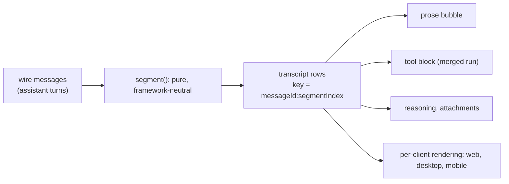

# ADR-0025: Segmented assistant transcript rendering

## In brief

- Chat bubble carries prose. Nothing else. Reasoning, tool calls, attachments render as sibling rows, never bubble contents.
- One wire message maps to many transcript rows. Row keys are `messageId:segmentIndex`. No one-to-one assumption anywhere.
- A contiguous agent run merges across adjacent assistant messages into one tool block. Turn boundaries are wire artifacts, not user-visible.
- Message actions attach to a message's last text row only. One menu per message, not per row.
- Tool chrome is heuristic: icon by name pattern, chip from a fixed input-key list, generic fallback. No tool registry, no per-tool component. An unknown tool degrades, never breaks.
- Segmentation is a pure function in `packages/ui`, framework-neutral. Rendering is per client. Web, mobile, and desktop share the split, not the JSX.
- Cost: chip summaries surface tool input without expanding a row. A tool putting a secret in `command`, `url`, or `query` leaks it into the transcript. Accepted, with the obligation on tool authors.

## Context

An assistant turn is not one thing. It carries prose, reasoning, tool calls with inputs and outputs,
and attachments, and the wire protocol splits that across however many messages the model produced.
Rendering each wire message as one chat bubble puts tool output and reasoning inside a prose bubble
and exposes turn boundaries that mean nothing to the reader.

The decision is invisible from the code. A contributor fixing "the tool output lost its bubble
styling" would revert the separation with every check green, because no test asserts it.

## Decision

A chat bubble carries prose and nothing else. Reasoning, tool calls, and attachments are siblings of
the bubble, not contents of it.

Segmentation is a pure, framework-neutral function in `packages/ui`: it takes wire messages and
returns transcript rows, keyed `messageId:segmentIndex`. One wire message therefore maps to many
rows, and nothing downstream may assume a one-to-one correspondence — a constraint every future
transcript feature (permalinks, per-row actions, virtualization, editing) must respect. A contiguous
agent run merges across adjacent assistant messages into a single tool block, because turn
boundaries are wire artifacts rather than something the reader should see. Message actions attach to
a message's last text row, so there is one menu per message rather than one per row.

Tool presentation is deliberately heuristic rather than registry-driven: the icon comes from a name
pattern, the chip summary from a fixed list of input keys, and anything unrecognized falls back to a
generic presentation. The explicit no: do not build a tool registry or per-tool components. An
unknown tool must degrade, never fail to render.

Clients share the split, not the markup. Rendering the rows is per client.

## Consequences

- Row count is not message count. Any feature indexing the transcript must key on
  `messageId:segmentIndex`.
- Chip summaries surface tool input without the row being expanded. A tool that places a secret in
  `command`, `url`, or `query` leaks it into the transcript. The obligation sits with tool authors;
  the transcript does not attempt redaction.
- Heuristic tool chrome will occasionally present an unfamiliar tool plainly. That is the accepted
  trade for never failing to render one.

## Updates

- 2026-08-19T09:00:00Z: Recorded retroactively while backfilling PR 55's documentation. The
  segmentation model shipped with that PR; only the record is new.
