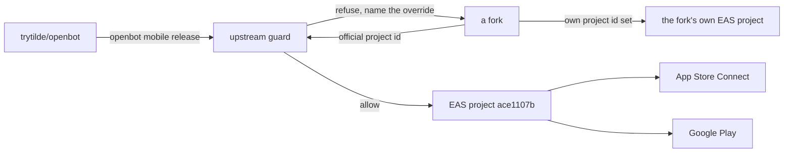

# ADR-0027: Official app store publication through EAS

## In brief

- One published mobile app. `trytilde/openbot` owns the EAS project, bundle identifier, and both store listings.
- EAS project `ace1107b-b007-451a-8e50-2b571c40593e`, owner `trytilde`, identifier `dev.openbot.mobile`.
- Forks cannot publish to it. The guard is code in the CLI, not a comment in a config file.
- A fork releases its own app by setting `OPENBOT_EAS_PROJECT_ID`, `OPENBOT_APP_ID`, and `OPENBOT_EXPO_OWNER`.
- `app.json` becomes `app.config.ts` so store identity can be overridden without editing a tracked file.
- `openbot mobile release build|submit|status|credentials`. Nothing spends money or publishes without `--yes`.
- `eas-cli` runs through `npx eas-cli@latest`, deliberately unpinned.
- Store credentials stay in EAS and Apple/Google, never in this repository.

## Context

OpenBot is forkable by design: ADR-0001 makes `configuration/` fork-owned, and every fork is a
real installation. App store publication does not follow that shape. There is one "OpenBot" in
the App Store and Play Store, one bundle identifier, one set of review relationships, and one
EAS project holding the signing credentials. That identity belongs upstream.

The risk is specific. A fork inherits every tracked file, so an inherited EAS project ID and
bundle identifier would let a fork run a build against the official project or, worse, submit
to the official listing. Permissions would refuse most of it, but relying on a remote service's
authorization to protect a public listing is not a boundary — it is a hope.

## Decision

`trytilde/openbot` owns store publication. The official EAS project is
`ace1107b-b007-451a-8e50-2b571c40593e` under owner `trytilde`, with identifier
`dev.openbot.mobile`, and `apps/mobile/eas.json` carries the development, preview, and
production profiles. Production uses `appVersionSource: remote` with `autoIncrement`, so build
numbers live in EAS rather than in a tracked file where every fork merge would conflict.

`app.json` becomes `app.config.ts`. Store identity reads from the environment with the official
values as defaults, so a fork overrides `OPENBOT_EAS_PROJECT_ID`, `OPENBOT_APP_ID`,
`OPENBOT_EXPO_OWNER`, and optionally the name, slug, and scheme from its own
`configuration/.env` without editing a file that upstream also owns.

Publication runs through `openbot mobile release`, per ADR-0018. Its guard refuses when the
resolved EAS project is the official one and `origin` is not `trytilde/openbot`, naming the
override a fork needs. This is deliberately narrow: a fork with its own EAS project is not
blocked, because the thing being protected is the official identity, not the act of releasing.
`build` and `submit` also require an explicit `--yes`, because both spend plan build minutes and
`submit` changes a public listing.

`eas-cli` is invoked as `npx eas-cli@latest` rather than added as a dependency. It releases far
more often than this repository, and a pinned copy fails against the current EAS API; the cost
is that a release needs network access to fetch it.

Signing credentials, service account keys, and App Store Connect API keys stay in EAS and in the
Apple and Google consoles. None of them enter this repository, `configuration/`, or an ADR.

## Consequences

- One store identity with one owner, and a fork cannot reach it by inheriting tracked files.
- A fork that wants its own app has a documented path and no patch to maintain.
- `app.config.ts` replaces `app.json`, so Expo config is now code. It must stay free of secrets
  and of anything requiring a build step.
- Releases need an authenticated `eas` session and paid Apple and Google accounts, so they
  cannot run in an ordinary CI job without credentials.
- Build numbers live in EAS. Reading the current version means asking EAS, not the repository.
- `npx eas-cli@latest` means a release depends on the network and on upstream not shipping a
  breaking CLI change mid-release.

## Updates

- 2026-08-19T10:20:00+02:00: Initial decision.
