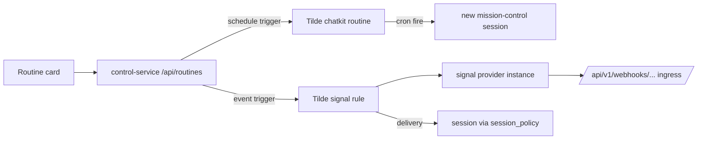

# 0030 — Routines and signals as one unified trigger surface

## In brief

- One user concept: Routine. Name, instruction, 1–8 triggers.
- Trigger is schedule (Tilde ChatKit routine, UTC cron) or provider event (Tilde
  signal rule on a signal provider instance).
- One card can map to many Tilde resources. Grouping lives in Tilde `metadata`
  stamps, not in OpenBot storage.
- Control service projects owner routes `/api/routines/*` and `/api/signals/*`;
  never rides `/api/chat/*` (ADR-0014).
- Web renders an agent details pane; mobile is deferred.
- Self-hosted deviation: webhook URL and signing secret are user-visible.

## Decision

Tilde models scheduled runs (routines) and third-party webhooks (signals: provider
instances, rules, deliveries) as unrelated resources. OpenBot presents both as one
Routine with OR'd triggers because owners think "run this instruction when any of
these happen", not "manage two resource types".

### Grouping via Tilde metadata

Every Tilde resource OpenBot creates for a routine is stamped
`metadata.openbot = { group, trigger }` (signal rules additionally carry
`instruction`, since rules have no prompt field). Unified cards are reconstructed
statelessly from list calls; unstamped resources are invisible to the unified list.
This required an upstream `trytilde/api` change adding optional `metadata` to
`Routine` and `SignalRule`, chosen over an OpenBot-local mapping database (drift,
migrations) and over title-encoded markers (leak into session titles).

### Contracts and state

Wire shapes live in `packages/client-runtime` (`contracts/routines.ts`,
`contracts/signals.ts`) with the client methods and `routines`/`signals` store
slices, per ADR-0017. No Tilde event stream exists for these resources, so the
runtime polls while the details pane is open, stale-while-revalidate. Mutations
return the full refreshed routine list for the agent; clients replace wholesale and
never patch caches.

### Semantics

- Unified `enabled` is true when any member is enabled; toggling fans out to all
  members. Rule creation is force-enabled upstream, so a disabled create immediately
  patches the rule disabled.
- Routine updates are PATCH upstream; rule updates are full-replace, handled by
  read-modify-write. A rule's instance or signal type cannot change upstream, so
  such edits recreate the rule under the same trigger stamp.
- Tilde has no run-now endpoint: Test run creates a mission-control session titled
  with the routine name and sends the instruction — identical to the upstream
  scheduler's behavior.
- Tilde keeps no cron run log: run history merges signal deliveries (matched by
  rule ids) with the routine's `last_run_at`/`last_session_id`/`last_error`
  snapshot.
- One event trigger maps to exactly one signal rule and one signal type; filters are
  `filter.json_equals` equality on the provider's normalized payload.

### Provider connections

Signal provider instances are managed inline from the trigger card and inventoried
at `/settings/signals`. OpenBot is self-hosted, so provisioning is user-visible: the
control service pre-assigns `spi_` ids to render the deterministic webhook URL, and
the signing secret is supplied by the owner, write-only, placed in
`configuration.provider_webhook_signing_key`. Providers are catalog-driven, not
hardcoded; providers upstream cannot auto-provision (Slack today) surface the
upstream error verbatim.

### UX deviations from the reference experience

Recorded deliberately: UTC-only schedules (Tilde cron has no timezone), no interval
frequency, a delete confirmation dialog, single-event triggers, and surfaced webhook
provisioning. The details pane toggle uses `mod+alt+d` because `mod+alt+b` was
already bound to the Computer pane.

## Cross-client parity

- Web and Electron: shipped (Electron renders the same web tree).
- Expo mobile: deferred.

<FOLLOW UP>
Expo mobile routines: render the routines list, editor, and provider connect flow
natively against the existing client-runtime contracts, slices, and helpers
(`routineDetail`, `scheduleTriggerSentence`, `cronForPreset`,
`describeEventTrigger`) using BNA UI components and RN sheets in place of anchored
popovers. No new contracts are expected.
</FOLLOW UP>

## Upstream dependencies

- `trytilde/api`: optional `metadata` on `Routine`/`SignalRule`; serialized
  `webhook_verification` descriptor in the signals provider catalog. Until deployed,
  the control service falls back to a webhook-auth heuristic for
  `requires_signing_key`, and metadata stamps require the upstream field to persist.
- `trytilde/harness-sdk`: typed per-provider signal families (slack and fake added;
  github/sentry/firecrawl pre-existing), `SignalMetadata` delivery/instance/rule
  ids, and a generic `onUnprocessed.signal` fallback so unknown signal types are no
  longer dropped silently.
