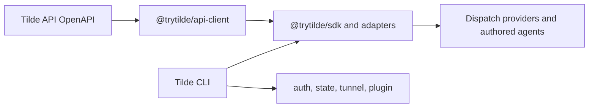

# ADR-0030: Tilde SDK and CLI ownership

## In brief

- Keep Dispatch product name. No umbrella rename.
- Tilde SDK packages live here. No Harness repository dependency.
- `@trytilde/cli` and its `tilde` binary own auth, state, tunnel, plugin, and Dispatch commands.
- Public SDK names use `@trytilde/sdk*`. No `harness` package names.
- SDK versions stay independent. Dispatch fixed group unchanged.

## Context

Dispatch consumed the generated Tilde API client, core SDK, Vercel AI adapter, and Tilde CLI
from `trytilde/harness-sdk`. A single Tilde capability therefore required coordinated SDK and
Dispatch changes, releases, or Git commit pins. Coding agents also needed two repositories to trace
one call path. The Harness name described an old implementation context rather than a useful
public boundary.

Dispatch remains a distinct application: it owns installations, clients, Computers, provider
lifecycles, and deployment. Tilde remains the platform and SDK namespace. Source locality does not
collapse those product and state boundaries.

## Decision

The generated client, core SDK, React adapters, and Vercel AI adapters live under
`packages/api-client` and `packages/sdk*`. Their public packages are `@trytilde/api-client`, `@trytilde/sdk`,
`@trytilde/sdk-react`, `@trytilde/sdk-vercel-ai-node`, `@trytilde/sdk-vercel-ai-react`,
`@trytilde/sdk-codex`, `@trytilde/sdk-claude-code`, `@trytilde/sdk-cursor`,
`@trytilde/sdk-opencode`, and `@trytilde/sdk-gemini-cli`.
Coding-agent MCP and skill-registry setup is an internal part of the Tilde CLI, not another
public package. The old `@trytilde/harness-sdk*` and `@trytilde/harness-plugins` names receive no
in-repository compatibility packages.

The Tilde CLI is published as `@trytilde/cli` with the `tilde` binary. Its authentication, team
selection, state import/export, and local-runtime tunnel commands are `tilde auth`,
`tilde state`, and `tilde tunnel`. Coding-agent resource setup becomes `tilde plugin`.
OpenAPI refresh and package validation become the `tilde sdk` developer command.

SDK package versions remain independent of Dispatch's fixed Changesets group because they are
general Tilde integration contracts with consumers outside the Dispatch application. Workspace
dependencies provide atomic source changes; packed-consumer smoke tests preserve the external npm
boundary. Existing auth and tunnel state locations are compatibility read paths, while new writes
use names without Harness.

## Consequences

- One repository and pull request can change a Tilde SDK contract and every Dispatch consumer.
- External SDK consumers keep a narrow package boundary and independent release cadence.
- Consumers of old Harness package names or the previous product-named binary need an explicit migration.
- Tilde API OpenAPI remains an external service contract even though generation now runs here.

## Updates

- 2026-08-30: Harness-neutral ChatKit recording remains in `@trytilde/sdk`,
  while Codex, Claude Code, and Cursor hook-wire adapters use dedicated
  `@trytilde/sdk-*` packages. `tilde plugin` remains the one setup command: it
  installs Tilde MCP and skill resources, native harness hooks, non-secret
  ChatKit routing configuration, and a packaged Codex plugin where Codex
  requires plugin-owned hooks.
- 2026-08-31: OpenCode and Gemini CLI receive matching dedicated adapters and
  native fail-open audit installation, completing ChatKit audit support across
  every coding harness configured by `tilde plugin`.
- 2026-09-03T15:03:26+02:00: Published the unified command surface as `@trytilde/cli` with the
  `tilde` binary while retaining Dispatch as the application name.
