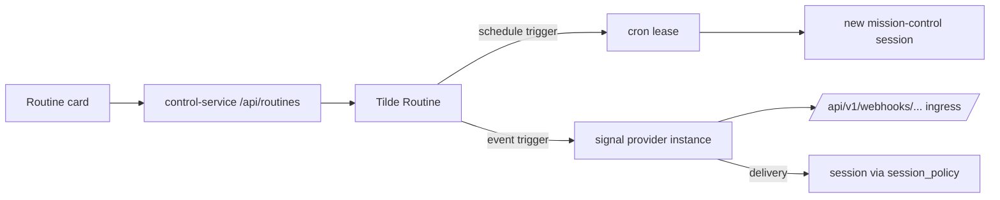

# ADR-0031: Routines and signals as one unified trigger surface

## In brief

- One user concept: Routine. Name, instruction, 1–8 triggers.
- Trigger is a native Tilde Routine schedule (UTC cron) or provider event.
- One card maps one-to-one to one Tilde Routine with transactional trigger children.
- Control service projects owner routes `/api/routines/*` and `/api/signals/*`;
  never rides `/api/chat/*` (ADR-0014).
- Web renders an agent details pane; mobile is deferred.
- Self-hosted deviation: webhook URL and signing secret are user-visible.

## Decision

Tilde models scheduled and third-party event automation as one Routine with OR'd
trigger children. Signals continues to own provider instances, normalized
deliveries, and retries.

### Native Routine ownership

OpenBot calls Tilde's `/routines` endpoints directly. The Routine row owns shared
fields, authorization, enablement, optimistic version, and 1–8 trigger rows. Create,
trigger replacement, and deletion are atomic, so the control service has no grouping
metadata, pagination reconstruction, or compensating rollback.

### Contracts and state

Wire shapes live in `packages/client-runtime` (`contracts/routines.ts`,
`contracts/signals.ts`) with the client methods and `routines`/`signals` store
slices, per ADR-0017. No Tilde event stream exists for these resources, so the
runtime polls while the details pane is open, stale-while-revalidate. Mutations
return the full refreshed routine list for the agent; clients replace wholesale and
never patch caches.

### Semantics

- Routine `enabled` is the global override; each trigger also retains independent
  enablement.
- Replace-all trigger edits send `expected_version` and fail on concurrent changes.
- Test run delegates to Tilde's native `/routines/{id}/run` endpoint.
- Run history is a durable Tilde ledger for schedule, event, and manual execution.
- Event triggers retain filter, session policy, ChatKit action, routing, and explicit
  `signal_only` or `signal_and_instruction` semantics. OpenBot uses
  `signal_and_instruction`.

### Provider connections

Signal provider instances are managed inline from the trigger card and inventoried
at `/settings/signals`. OpenBot is self-hosted, so provisioning is user-visible: the
control service pre-assigns `spi_` ids to render the deterministic webhook URL, and
the signing secret is supplied by the owner, write-only, placed in
`configuration.provider_webhook_signing_key`. Providers are catalog-driven, not
hardcoded; providers upstream cannot auto-provision (Slack today) surface the
upstream error verbatim.

### UX deviations from the reference experience

Recorded deliberately: UTC-only schedules (Tilde cron has no timezone), no interval
frequency, a delete confirmation dialog, single-event triggers, and surfaced webhook
provisioning. The details pane toggle uses `mod+alt+d` because `mod+alt+b` was
already bound to the Computer pane.

## Cross-client parity

- Web and Electron: shipped (Electron renders the same web tree).
- Expo mobile: deferred.

<FOLLOW UP>
Owner: apps/mobile
Trigger: this routines and signals capability merges for the web and Electron clients
Work: render the routines list, editor, and provider connect flow natively against the existing client-runtime contracts, slices, and helpers using BNA UI components and React Native sheets, then prove the workflows on both Android and iOS
</FOLLOW UP>

## Upstream dependencies

- `trytilde/api`: native unified Routine endpoints and serialized
  `webhook_verification` descriptors in the signals provider catalog.
- `@trytilde/api-client`: generated routines, signals, metadata, and webhook
  verification contracts. Stable hand-authored behavior remains owned by
  `@trytilde/sdk`; OpenBot does not reintroduce the retired Harness package names.
