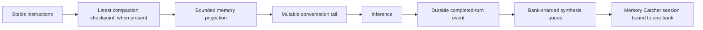

# ADR-0034: Opt-in automatic memory

## In brief

- The reusable Tilde SDK defaults automatic memory to `none`; OpenBot explicitly
  deploys ordinary bots with `personal_plus_agent` and a dedicated agent bank.
- Tilde derives memory authority from the durable triggering ChatKit message;
  OpenBot never supplies a user identity or bank ID during recall.
- The agent inserts a deterministic bounded projection after stable instructions
  and any compaction checkpoint so provider prompt-prefix caching remains useful.
- Memory Catcher is a least-privilege user-deployed background agent with one
  server-bound synthesis session per bank and no memory bank of its own.

## Decision

OpenBot uses the high-level Tilde automatic-memory controller around inference.
An owner can select `none`, `personal`, `personal_plus_agent`, or `team`, and can
inspect, edit, or delete visible facts. OpenBot's deployment default is
`personal_plus_agent`; callers of the reusable SDK must opt in explicitly.

Recall is tied to the newest durable triggering message ID. Tilde authenticates
the recipient bot, resolves the effective actor and current bank visibility, and
returns bounded provenance for the bank, memory, evidence, source, and learning
bot. OpenBot inserts that projection as a dynamic system suffix:

ChatKit, not the OpenBot model loop, performs idempotent post-turn evidence
enqueueing. Explicit owner facts remain owner-editable and protected from
automatic overwrite.

Memory Catcher uses `zai/glm-5.3-flash`, receives only session-bound recall,
retain, supersede, and completion tools, and never receives a model
argument for a bank, tenant, or user. It has no automatic memory mode or owned
bank, preventing recursive synthesis. Its instructions prohibit human messaging;
dynamic `sendMessage` and unbound memory tools are removed before inference.

## Consequences

- Cache-stable instructions remain byte-identical across turns; only the bounded
  memory suffix and conversation tail vary.
- Authorization stays in Tilde and follows current bank visibility rather than
  caller-declared identities.
- A failed or absent synthesizer does not block foreground inference; durable
  evidence remains queued until the configured bank synthesizer can process it.
- Forks must scaffold and deploy Memory Catcher and reconcile ordinary agents'
  memory bundle fields.

<FOLLOW UP>
Owner: Tilde Memory API and OpenBot Memory Catcher
Trigger: the synthesis-session delete operation accepts a batch identity and
writes the same durable mutation receipt as retain/supersede
Work: restore the model-visible background forget tool and prove a forget-only
batch completes exactly once without retrying an already-applied deletion
</FOLLOW UP>
