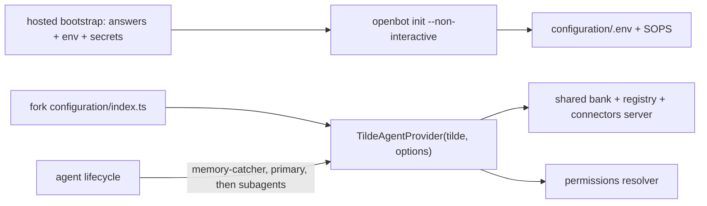

# ADR-0039: Hosted non-interactive init and shared agent resources

## In brief

- `openbot init --non-interactive` accepts `runtime: exe-dev`. A hosted bootstrap preseeds
  `AI_GATEWAY_API_KEY` and `CODE_STORAGE_REPOSITORY_TOKEN` in the init process environment; init
  stores them to SOPS unchanged and asks for neither a Vercel token nor the Code Storage
  organization key.
- Init scaffolds one thing: the Factory agent and Memory Catcher. No scaffold profiles, no
  environment switch selecting product agents. Those live in a fork's `configuration/` (ADR-0001).
- `TildeAgentProvider` takes opt-in options from the fork composition root:
  `sharedResources` (one memory bank, skill registry, and connectors MCP server owned by the
  primary agent and pinned by subagents) and `permissions` (a resolver deciding each agent's
  reach). Default: off. Every agent keeps its own resources and permissions are never set.
- Persisted names stay neutral: `OPENBOT_SHARED_MEMORY_BANK_ID`, `OPENBOT_SHARED_SKILL_REGISTRY_ID`,
  `OPENBOT_SHARED_CONNECTORS_MCP_SERVER_ID`; `OPENBOT_OWNER_USER_ID` overrides the bundle owner.
- The lifecycle reconciles Memory Catcher, then the primary agent, then the rest concurrently.

## Context

A hosting control plane provisions an OpenBot VM, clones the owner's fork, and runs init without a
TTY. It already holds an inference gateway key and a repository-scoped Code Storage token, and it
must not be asked for the platform credentials that would mint them. Some forks also want their
primary agent and its subagents to behave as one product: one memory, one skill registry, one
connectors server, and reach narrowed to the owner. Hard-coding such a product into init or into
the provider behind an environment switch would put fork material upstream, contradicting the fork
model, and would make upstream choose product names and defaults.

## Decision

Init gains the hosted path only. `builtInRuntimeInitializationProviders(runtime, inference,
environment)` passes the init process environment to the Vercel inference provider, which drops
its platform dependency and questions when `AI_GATEWAY_API_KEY` is present; the Code Storage
provider persists a preseeded `CODE_STORAGE_REPOSITORY_TOKEN` without the organization key. The
scaffold stays the Factory agent plus Memory Catcher; every agent renders `tools/browser_session.ts`
(ADR-0040) and the agent template connects to a shared connectors server when
`OPENBOT_SHARED_CONNECTORS_MCP_SERVER_ID` is set.

Sharing and reach are provider configuration, set once in `configuration/index.ts`:

```ts
new TildeAgentProvider(tilde, {
  sharedResources: { memoryBank, skillRegistry, connectorsMcpServer },
  permissions: (agent) => AgentPermissions | undefined,
});
```

The contract (`AgentProviderOptions`, `SharedAgentResources`, `ReconciledAgent`,
`AgentPermissionsResolver`, `sharedAgentResourceEnvironment`) lives in the provider package's
`src/core.ts`. With `sharedResources`, the primary bundle owns the shared bank (synthesizer
`memory-catcher`) and the shared registry holding the union of every authored agent's skills, the
provider reconciles the shared connectors server with personal tool federation `all`, and after
activation subagents are bound to `[shared bank, ...additionalBankIds]` and every agent to the
shared server. With `permissions`, the resolver receives `{ id, kind, subagentIds, ownerUserId }`
and returns the permissions to set or `undefined`; it may throw to fail closed. Upstream never
decides who the owner is beyond reading the bundle's `owner_user_id` and `OPENBOT_OWNER_USER_ID`.



## Consequences

- Upstream carries no product agents, names, or defaults; a fork composes them from its own
  `configuration/` tree and keeps them across upstream merges.
- The default installation is unchanged: no shared IDs are written, no permissions call is made,
  and the persisted `OPENBOT_SHARED_*` names only appear when a fork opts in.
- A subagent refuses to deploy before the primary recorded the shared IDs it pins, so the ordering
  guarantee in the lifecycle is load-bearing.
- The provider picks no defaults for a fork: a shared bank requires
  `OPENBOT_AUTOMATIC_MEMORY_MODE=personal_plus_agent` in the fork's `configuration/.env` (which
  also lets the lifecycle deploy Memory Catcher); an inconsistent configuration fails with
  `invalid_configuration` before provisioning.
