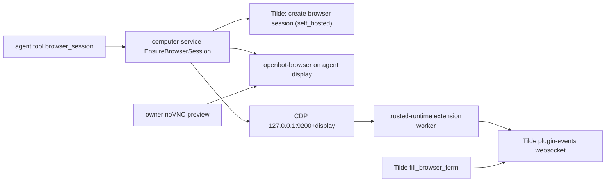

# ADR-0040: The Computer's Chrome is a self-hosted Tilde browser runtime

## In brief

- The Computer image and the host Computer ship Tilde's trusted-runtime extension, vendored
  verbatim under `packages/computer-service-provider/src/base/assets/trusted-runtime-extension/`
  with a `PROVENANCE.md`, at `/opt/openbot/trusted-runtime-extension`.
- `openbot-browser` starts each agent display's Chrome with only that extension, a loopback
  DevTools port derived from the display (`9200 + display number`), `--password-store=basic`, and
  a managed policy that disables Chrome's password manager and sync.
- computer-service gains `EnsureBrowserSession(agent_id)`: register one `runtime: self_hosted`
  Tilde browser session per agent, start Chrome when needed, bootstrap the extension over CDP,
  and re-bootstrap on every call so a restarted Chrome reconnects.
- `@tryopenbot/computer-tools` exposes it as the `browser_session` tool; Tilde's
  `fill_browser_form` and human-handoff tools then work unchanged against the Computer's browser.
- Only the trusted host Computer receives the Tilde tenant (`TILDE_API_KEY`, `TILDE_ORG_ID`,
  `TILDE_TEAM_ID`, `TILDE_BASE_URL`) and `COMPUTER_PREVIEW_ORIGIN`; sandboxed Computers report
  `FailedPrecondition`.

## Context

Tilde's managed-credential fill (`fill_browser_form`) and human handoff assume a browser session
whose extension runtime is connected to Tilde. Today that runtime exists only inside Browserbase.
Authored agents need the same guarantees on the Computer that already gives each agent a display
and browser profile (ADR-0015, ADR-0029): credentials must never pass through the model, one-time codes must be
minted at fill time, and the owner must be able to take over the same browser through noVNC.

## Decision

The browser runtime is a Computer concern, not a provider or agent concern.

- **Extension on disk.** The extension files are third-party runtime bytes copied verbatim into the
  image context and the host install; they are not Handlebars templates. Updates replace the files
  and the commit recorded in `PROVENANCE.md`.
- **Launcher.** `openbot-browser.sh` adds `--load-extension`/`--disable-extensions-except` for the
  vendored directory, `--remote-debugging-port=$((9200 + display))`,
  `--remote-allow-origins=http://127.0.0.1:*`, `--password-store=basic`, `--no-first-run`, and
  `--no-default-browser-check`. `/etc/opt/chrome/policies/managed/openbot.json` (and the chromium
  path) sets `PasswordManagerEnabled: false`, `PasswordLeakDetectionEnabled: false`,
  `AutofillCreditCardEnabled: false`, `SyncDisabled: true`, and `BrowserSignin: 0`.
- **RPC.** `EnsureBrowserSession` ensures the agent desktop, derives the DevTools port from the
  display, creates the Tilde session once (request `{ runtime: "self_hosted", computer_id,
  agent_id, preview_url }`, response `{ id, runtime_token }`) through a `BrowserSessionRegistry`
  adapter, persists `{ id, runtimeToken }` with mode `0600` beside the desktop state, launches
  `openbot-browser` on the agent display when the port is closed, then runs the CDP bootstrap
  ported from Tilde: wait for the extension service-worker target, attach, evaluate the bootstrap
  expression that sets `globalThis.__tildeTrustedRuntimeBootstrap` (with the token) and stores only
  the tenant fields, and read `connected`. The response carries `browser_session_id`,
  `preview_url` (the control-service `/api/computer/<agent>/preview` route), the port, and
  `runtime_connected`. A missing worker is reported, not thrown.
- **Trust boundary.** The Tilde tenant reaches computer-service only through the host Computer's
  private environment file, which is already the trusted single-VM mode. Microsandbox and Vercel
  Sandbox Computers never receive it.

## Consequences

- Password fill, TOTP minting, and human handoff reuse Tilde's existing code paths; OpenBot adds no
  credential handling of its own and the model never sees a secret.
- The runtime token lives on the Computer disk next to the browser profile it protects; both are
  already treated as sensitive user data.
- The Tilde `runtime: self_hosted` API is delivered by tilde-api WP-D. Until it lands, the HTTP
  adapter cannot register sessions; the fake adapter covers computer-service tests.
- Display routing remains routing, not isolation: every agent's Chrome shares the Computer's
  process identity and filesystem.

<FOLLOW UP>
Owner: computer-service browser runtime
Trigger: tilde-api ships `runtime: self_hosted` browser sessions and the `plugin-events` route accepts them
Work: verify `TildeBrowserSessionRegistry` against the real endpoint, add the Browserbase-parity debugger URL fields, and surface `runtime_connected` in the owner preview
</FOLLOW UP>
