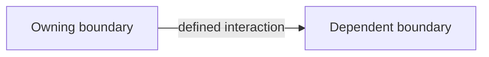

# Architecture decision records

ADRs preserve major architecture, strongly opinionated code, and durable code or product design decisions whose reasoning is not obvious from the code. Use the next sequential filename: `NNNN-short-slug.md`.

Keep each ADR short. Record the decision and why it should survive future cleanup. Add options or consequences only when they help a future reader. Include the smallest useful Mermaid diagram when a boundary, flow, hierarchy, or state transition is involved; omit decorative diagrams.

When a later decision amends or materially clarifies an existing ADR, update the
authoritative prose and append an entry under `## Updates`. Entries are
chronological bullet points in the form
`- YYYY-MM-DDTHH:mm:ssZ: What changed and why.` Use a complete ISO 8601
timestamp with an offset or `Z`. Never rewrite or delete an older update. Omit
the section from a new ADR until it is amended.

The `In brief` bullets use caveman style: terse fragments, exact nouns, explicit negation. The rest uses concise normal prose.

## Template

````md
# ADR-NNNN: Short decision title

## In brief

- Choose {decision}. Keep {reason}.
- Boundary stays {owner}. No leak.
- Cost: {main trade-off}. Accepted.

## Context

{What forced this decision and why the answer was not obvious.}

## Decision

{What OpenBot will do, including the important no.}



## Consequences

- {Important benefit or constraint.}
- {Known cost or follow-up.}

## Updates

- {ISO 8601 timestamp}: {What changed and why.}
````

Remove sections that add no durable information. Keep `In brief`, `Context`, and `Decision`. Remove `Updates` until a later decision amends the record. Mermaid is expected where it clarifies a real relationship; replace the example rather than copying it unchanged.
