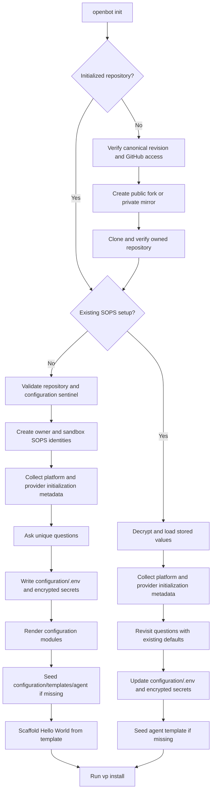
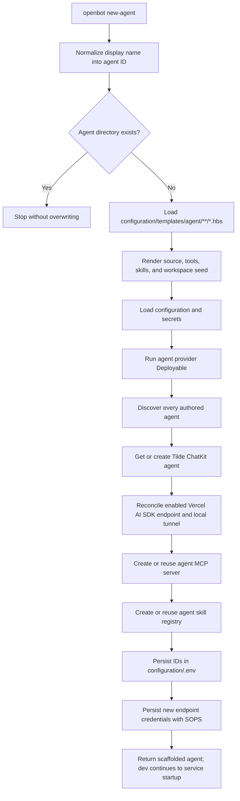
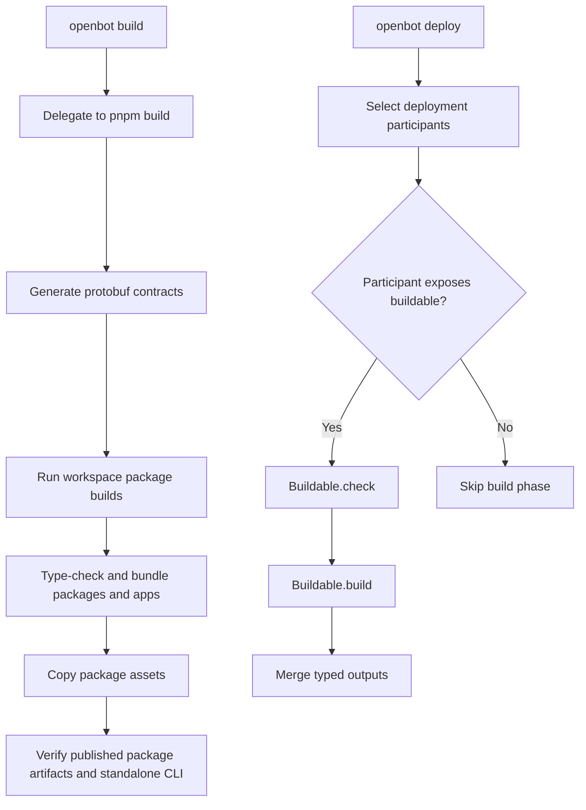
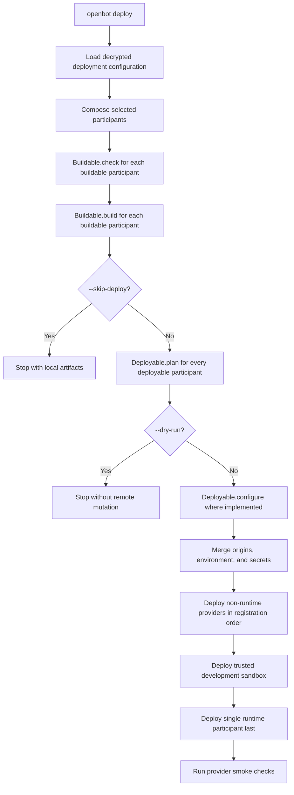

# OpenBot lifecycle

OpenBot uses typed lifecycle hooks. Hooks own work. Events only report progress.

## Initialization

`openbot init` creates or revisits fork-owned configuration. Shared platforms are collected once, even when several providers use them.

### Initialization metadata

`Platform.initialization` describes shared vendor setup. Put account, organization, team, token, and base-URL questions here. Do not create remote resources here.

Provider `initialization` describes provider-only values. Put project names or provider-specific options here. Do not repeat platform questions.

Question destinations decide storage:

- `environment`: non-secret values in `configuration/.env`.
- `secret`: runtime secrets in `configuration/secrets.enc.yaml`.
- `deployment-secret`: deployment authority that must not reach runtime services.

Keep initialization deterministic. It should collect configuration, validate access, render files, and install dependencies. Resource creation belongs to reconciliation or deployment.

## Adding an agent

`openbot new-agent` materializes source, then runs the same idempotent development reconciliation used by `openbot dev`. Production deployment runs that lifecycle again with the deployed agent-service base URL.

### `scaffoldAgentTemplates`

Put the packaged default template here. Seed `configuration/templates/agent/`
only when it is missing; never overwrite fork changes during reconfiguration.
Do not contact a remote platform inside the filesystem scaffolder. The
`new-agent` command invokes provider reconciliation only after scaffolding
finishes.

### `scaffoldAgent`

Load the fork-owned `configuration/templates/agent/**/*.hbs` files here and
render their relative paths without the `.hbs` suffix. Put authored filesystem
creation here: `agent.ts`, instructions, instrumentation, tools, skills,
library code, and workspace seed files. Keep it atomic, require the supported
core files, and never overwrite an existing agent. Do not call Tilde, Vercel,
or another remote platform.

### `reconcileAgentResources`

Use this CLI coordinator only to schedule provider lifecycles and persist their declared outputs, plus the remaining MCP and skill-registry provisioning. Tilde agent get/create/update/status behavior belongs in `TildeAgentProvider.deployable`, never in the CLI. A retry must converge without duplicate agents, endpoints, MCP servers, or registries.

Generated agents read their own `AGENT_<ID>_*` values. Do not use one global MCP server or skill registry for every agent.

## Building

Repository builds and deployment artifact builds are related but distinct.

### `Buildable.check`

Put read-only artifact validation here. Check source shape, required local tools, configuration, and provider-specific build prerequisites. Fail before expensive work. Do not create projects, publish images, or deploy services. Repeated calls must return the same result for unchanged inputs.

### `Buildable.build`

Put reproducible, idempotent artifact creation here. Compile code, render ignored deployment assets, assemble Vercel Build Output, or build a local computer image. Return named outputs such as artifact paths and content digests. Repeated calls may replace the same ignored artifact but must not accumulate state. Do not release the artifact to production.

Package `build` scripts compile publishable workspace packages. They are not provider lifecycle hooks and must not provision infrastructure.

## Deploying

`openbot deploy` builds first, plans every deployable participant, configures prerequisites, then deploys the runtime last.

### `Deployable.plan`

Put read-only planning here. Describe intended work and expose useful steps for humans or JSON output. It may inspect current state, but it must not mutate local or remote state. Never include secret values in a plan or event.

### `Deployable.configure`

Put stable prerequisites here. Create or reuse project identities, reserve stable origins, and return values needed by later participants. Make it idempotent. Do not publish the final release here.

### `Deployable.deploy`

Put remote mutation and release work here. Reconcile desired state: push or reuse images, install environment, upload prebuilt artifacts, seed durable workspaces once, reconcile production agent endpoints, start services, and run smoke checks. Return new outputs and secrets through `DeploymentResult`. Every call must be safe to repeat and converge without duplicates.

Non-runtime providers run first. The trusted sandbox runs next. The single runtime participant runs last so it receives all accumulated environment and secrets.

### Deployment events

Use `context.report` for progress only. Report phase, participant ID, summaries, and safe counts. Do not use events to control ordering or pass values. Do not report secrets. Typed results and the coordinator own control flow.

### `DeploymentResult`

Return values through the narrowest channel:

- `outputs`: internal values for later lifecycle hooks.
- `environmentVariables`: non-secret runtime configuration.
- `secrets`: runtime secrets.
- `deploymentSecrets`: deployment-only credentials.
- `sandboxSecrets`: trusted development-sandbox secrets.
- `environmentVariableRemovals`: obsolete persisted non-secret values to unset.
- `secretRemovals`: obsolete persisted secrets to remove with SOPS.

Conflicting values must fail. Never use last-write-wins behavior.
