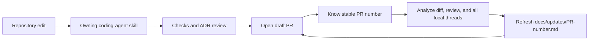

# OpenBot coding-agent workflow alignment

## Intent of the change

- Make coding agents follow current provider, agent, Computer, deployment, ADR, and fork-update rules.
- Add one agent-authoring workflow for Eve-shaped agent folders.
- Make PR creation block on stale package docs, misplaced provider contracts, missing ADR review, incomplete PR templates, or missing fork update records.
- Give every upstream PR one stable update record named by PR number.
- Build each update from full repository evidence and every locally available coding-agent thread, not only the active task.
- Keep runtime agent skills separate from repository coding-agent skills.

## Architecture changes

- No OpenBot runtime boundary changes.
- Coding workflow routes edits through owning skills and durable ADR/update records.
- Provider contracts live in owning package `src/core.ts` or `src/core/index.ts`.
- Agent source lives under `configuration/agents/<id>/`.
- PR workflow opens a draft first, then creates and continuously refreshes `docs/updates/<pr-number>.md`.
- Thread evidence gathering is read-only. Only PR-relevant conclusions enter git.

## Summarized package changes

- `.github/pull_request_template.md`: adds explicit repository-context, outcome, implementation, validation, state, deployment, security, ADR, README, provider-core, Changeset, update-record, frontend, limitation, review-feedback, and final-diff gates.
- `.agents/skills/create-or-update-agent`: adds the agent authoring workflow. Covers fixed layout, Zod tools, typed Computer calls, instrumentation, instructions, private workspace seeds, and `openbot new-agent`.
- `.agents/skills/create-pr`: enforces the checked-in PR template, package README public API checks, provider core placement, ADR review, and PR-numbered fork update records.
- `.agents/skills/create-pr`: requires draft creation before update generation, all-local-thread evidence review, privacy filtering, and refresh after every later PR change.
- `.agents/skills/create-pr`: emits the requested completion code phrase only when a user explicitly asks to skip the skill and merely open the PR. Phrase never enters git or GitHub content.
- `.agents/skills/implement-provider`: documents provider-local contracts, Handlebars assets, optional build/deploy lifecycle, prompt/tool hooks, and focused adapter tests.
- `.agents/skills/add-api-endpoint`: aligns RPC ownership and typed Computer service rules.
- `.agents/skills/run-openbot`: aligns blank-fork init, dev/local/Vercel ownership, separate desktop/control service, and deployment checks.
- `.agents/skills/grill-with-docs`: requires concise ADRs, useful Mermaid diagrams, and append-only timestamped updates.
- Other affected workflow skills use current package names, configuration paths, and deployment commands.
- `AGENTS.md`: clarifies shared Computer workspace seeding while preserving explicit typed per-agent Computer tools.
- ADR-0013 now owns stable PR-number records and continuous, privacy-filtered evidence refresh.
- Old hash-named update record removed and replaced by this PR-numbered record.
- No published package API, runtime configuration, secret format, or deployment artifact changed.

## Critical to apply to forks

yes

- Merge the `.agents/skills/`, `.github/pull_request_template.md`, `AGENTS.md`, ADR, and update-record changes. Otherwise future coding agents may recreate removed architecture or publish PRs without enough fork migration evidence.
- Keep custom provider interfaces in their owning provider package `core.ts` or `core/index.ts`.
- Keep custom agents under `configuration/agents/<id>/`; bind typed Computer tools to the fixed agent ID.
- Replace any hash-addressed upstream update-note automation with `docs/updates/<pr-number>.md`.
- Open draft PRs before generating update records. Refresh the same record after implementation or review changes.
- Permit read-only inspection of the local coding-agent thread store for update generation, but never commit unrelated conversation, raw transcripts, credentials, secrets, or personal data.
- Complete every applicable PR template checkbox honestly. Record checks that did not run.
- Validate changed skills with `quick_validate.py` and run `git diff --check`.
