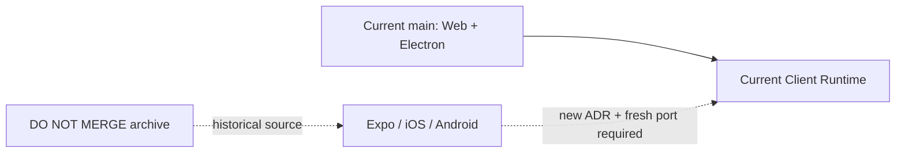

# Intent of the change

- Preserve paused native client source.
- Archive only. Never merge as-is.
- Keep recovery reference after main removes Expo/iOS/Android.
- Require fresh port from current main if mobile returns.

# Architecture changes

- No live architecture change.
- Branch holds old native renderer, mobile CLI, emulator, Metro, EAS, and store workflows.
- Main remains governed by ADR-0033 and OpenBot #110.
- Archive is reference material, not compatible restoration patch.

# Summarized package changes

- Preserve complete pre-removal `apps/mobile`.
- Preserve old `openbot mobile` commands and Android/iOS toolchain code.
- Preserve remote emulator tunnels and EAS publication workflows.
- Preserve Expo/EAS coding skills and historical contributor docs.
- Add this archive record only. No runtime, API, state, secret, or deployment mutation.

# Critical to apply to forks

yes

Do not merge this PR. Forks needing old mobile work may inspect or cherry-pick narrow ideas, but must start restoration from current main, refresh dependencies and contracts, add a new ADR, and prove current auth, ChatKit, tools, Computer, web parity, native devices, and store workflows.

