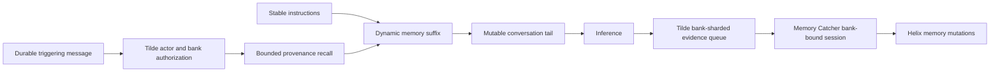

# Intent of the change

- Make durable memory an automatic part of ordinary OpenBot conversations while
  keeping the reusable Tilde SDK disabled until a caller explicitly opts in.
- Give every ordinary bot a lifecycle-owned memory bank and a bounded,
  provenance-bearing recall projection before inference.
- Deploy Memory Catcher as an ordinary user-owned background agent whose stable
  ChatKit synthesis session is bound by Tilde to exactly one bank.
- Let owners use the public SDK to inspect, edit, and delete explicit personal
  facts, and to pause or assign personal-bank background synthesis.

# Architecture changes

- Tilde remains the authorization, storage, queue, embedding, retrieval, and
  synthesis-session authority. OpenBot does not accept a model-supplied bank,
  organization, team, or user identifier during automatic recall or synthesis.
- The Agent Provider reconciles ordinary bots with `personal_plus_agent` memory.
  Memory Catcher reconciles first, with automatic memory disabled and no bank of
  its own, so its dependent bank creation cannot race or recurse.
- Stable authored instructions stay at the provider-cache prefix. A bounded
  untrusted-data projection follows them before the mutable conversation tail.
- The synthesis runtime exposes only session-bound recall/retain/supersede/
  completion operations plus read-only skill discovery. Communication,
  unbound memory, control-plane mutation, and batch-wrapper tools are excluded.
- Background forget is deliberately not model-visible yet: the current Tilde
  synthesis delete operation cannot bind the deletion to a batch or write the
  mutation receipt required for completion. It returns only after an API and
  regression test prove a forget-only batch completes exactly once without
  retrying an already-applied deletion.

# Summarized package changes

- `@trytilde/api-client`: refresh the generated contract from the merged Tilde
  Memory and organization AI-credit API surface.
- `@trytilde/sdk`: add stable camel-case clients for team, visible, and personal
  banks; owner-managed documents; source bindings; personal synthesizer
  assignment; synthesis sessions; and ChatKit automatic-memory settings/recall.
- `@trytilde/sdk-vercel-ai-node`: add the automatic-memory projection controller,
  request-bound synthesis tools, and a strict synthesis tool allowlist.
- `@tryopenbot/agent-provider`: reconcile agent-owned banks and automatic-memory
  modes without giving Memory Catcher recursive memory.
- `openbot`: scaffold Memory Catcher, its managed synthesis skills, required
  discoverable source files, deterministic dependency-first deployment, and
  automatic recall in future Factory templates.
- Documentation: record the opt-in SDK/default OpenBot policy in ADR-0034 and
  document the SDK, provider, agent, security, and caching behavior.
- Validation at initial publication: 78 core SDK tests, 92 Vercel adapter tests,
  14 Agent Provider tests, 19 Agent Service Provider tests, 172 CLI tests, and
  generated SDK validation for 628 operations and all ten SDK packages. The
  complete repository `pnpm check` and `pnpm build` gates also pass; remaining
  lint warnings are pre-existing in files outside this change.
- Local thread evidence was limited to the current coordinated implementation
  task and its parent status messages because no supported read-only interface
  for enumerating every unrelated local task was available. No private raw
  transcript, credential, or unrelated planning was copied here.

# Critical to apply to forks

yes — deploy the merged Tilde Memory API first, update generated SDK packages,
then rerun initialization or explicitly materialize the Memory Catcher agent and
the changed future-agent template. A customized fork must keep its authored
agent edits, add Memory Catcher with its two synthesis skills and restricted
tool surface, reconcile it before ordinary bots, and deploy ordinary bots with
their intended automatic-memory mode. No new OpenBot secret or environment name
is introduced. Existing fork-owned agents are not rewritten automatically and
must be migrated and exercised through background synthesis, foreground recall,
explicit-fact editing, and deletion before production rollout.
