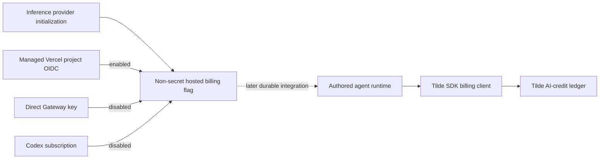

# Intent of the change

Give hosted OpenBot inference a safe billing foundation without coupling billing
to provider initialization. Agents can reserve organization AI credits before a
model call, commit one exact provider receipt, or release a failed reservation.
OpenBot marks only Tilde-managed Vercel project-OIDC inference as billable.
Direct owner Gateway keys and Codex subscription calls stay outside this meter.

This is a foundation PR. It does not copy the unmerged durable AgentRuns host.
The model-call controller and authored-agent webhook wiring follow after that
effect ledger exists on the target branch.

# Architecture changes

Tilde remains the billing and authorization boundary. OpenBot stores no billing
ledger or receipt Control State. Inference providers only reconcile one
non-secret environment marker and contribute fork-owned template source. They
do not gain request-time model factories or billing methods. Both Vercel and
Codex templates accept an optional model ID so the later durable host can bind a
job-selected model without changing provider ownership.

# Summarized package changes

- `@trytilde/sdk`: adds `BillingClient`, `AiCreditsClient`, reservation and
  context types, exact receipt commit input, client composition, focused request
  mapping tests, and Public API documentation.
- `@tryopenbot/inference-provider`: writes
  `OPENBOT_HOSTED_INFERENCE_BILLING=1` only for managed Vercel project OIDC,
  resets it to `0` for direct-key Vercel and Codex subscription inference,
  accepts optional per-call model IDs in provider-owned templates, and covers
  the selection rules with provider tests.
- `.changeset/add-hosted-inference-metering.md`: requests minor releases for
  the two changed public packages.
- No client renderer, protobuf, credential destination, external dependency,
  or tracked upstream `configuration/` content changes.

# Critical to apply to forks

yes — rerun `openbot init` after merging so the selected inference provider
reconciles `OPENBOT_HOSTED_INFERENCE_BILLING` in fork-owned configuration.
Customized inference templates should adopt the optional third `modelId`
argument before the stacked durable runtime integration. Do not enable hosted
billing manually for direct owner Gateway keys, BYOK generations, or Codex
subscription calls. Merge the durable AgentRuns SDK/host foundation before the
stacked model-call controller and webhook integration.
