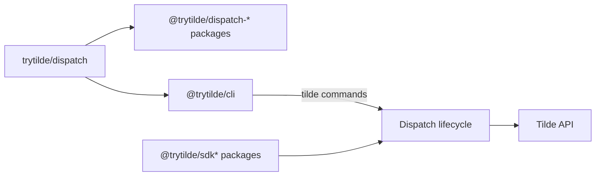

# PR 150: Establish Dispatch product identity

## Intent of the change

- Dispatch name everywhere. One product identity.
- `trytilde/dispatch` canonical repository. No stale repository owner/name.
- `@trytilde/dispatch-*` application packages. Tilde SDK packages stay `@trytilde/sdk*`.
- `@trytilde/cli` package, `tilde` executable. No product-named CLI.
- Breaking namespace cutover. No silent compatibility aliases.
- Current `main` preserved. No replay of already-merged stale feature work.

The original dirty checkout predated 78 commits already merged to `main`. Its complete state remains
recoverable in a named local stash. The final branch starts at current `origin/main` and reapplies
only the approved identity migration, so newer memory, work, room, capability, coding-agent, and
exe.dev behavior stays intact.

## Architecture changes

Dispatch remains the owner application. Tilde remains the platform, public SDK namespace, and
unified command surface. Repository bootstrap, package publication, generated contracts, desktop
identity, provider assets, runtime paths, persisted client keys, UI tokens, and documentation now
agree on that split.

The Computer protobuf package moves to `dispatch.computer.v1`. Dispatch-owned HTTP, OAuth,
hosted-instance, avatar, and generated OpenAPI names also move to Dispatch. This is a coordinated
wire change: the authoritative Tilde API must expose the new identity route and schema namespace
before a deployed Dispatch build can use those flows.

State classification:

- Repository configuration: package names, provider templates, repository URLs, and `DISPATCH_*`
  environment declarations.
- Secret material: values unchanged; names may move with their owning environment contract; no
  plaintext included.
- Control/client state: `.dispatch` paths, storage keys, OAuth audience/scope, and desktop protocol
  identity move to Dispatch.
- Ephemeral runtime state: process, image, service, VM, cache, and generated artifact names move to
  Dispatch.

ADR-0021 records the Dispatch UI class/token namespace. ADR-0030 records Dispatch as application
and `@trytilde/cli`/`tilde` as command owner. ADR-0013 continues to own canonical repository
bootstrap. No new provider, storage, authentication, or deployment owner is introduced.

## Summarized package changes

- `@trytilde/cli`: replaces the product-named package and binary. Help renders Tilde as command
  owner and Dispatch as the operated application. Init, dev, deploy, SDK, plugin, desktop, remote,
  and repository workflows use `tilde`.
- Fixed Dispatch package group: moves from the previous scope to `@trytilde/dispatch-*`; imports,
  exports, filters, Changesets, READMEs, templates, and package metadata move together.
- `@trytilde/api-client` and `@trytilde/sdk`: regenerated from the renamed Dispatch OpenAPI
  contract. `@trytilde/sdk-vercel-ai-node` consumes the renamed hosted identities.
- `@trytilde/dispatch-computer-service-proto`: source and generated output move to
  `dispatch/computer/v1` and `dispatch.computer.v1`.
- Web and UI: app module, runtime symbols, owner copy, local state keys, stylesheet export,
  `dispatch-*` classes, and `--dispatch-*` design tokens move as one surface.
- Electron: app name, bundle/protocol identity, preload bridge, executable, updater variables,
  service assets, and Linux package output move to Dispatch.
- Providers and Computers: service units, desktop launchers, image names, internal directories,
  deterministic resource prefixes, source-kind metadata, and fork paths move to Dispatch.
- Skills, ADRs, update records, workflows, examples, tests, provenance, and contributor instructions
  use current product, package, command, and repository names.
- Git provider README now documents its exported provider contracts, adapters, constants, and
  helper functions.
- Browser regression: the routines E2E now mocks current Work endpoints and asserts the already
  merged Work-pane hierarchy instead of a removed standalone panel.
- Release metadata: a dedicated breaking pre-1.0 Changeset covers the fixed Dispatch group and
  affected Tilde API/SDK packages. Existing pending Changesets target the new package names.

Validation completed on Linux:

- Focused CLI, control-service, agent-service-provider, computer-service-provider,
  client-runtime, and desktop tests pass.
- Full `pnpm check`, `pnpm build`, and `pnpm test` pass.
- Full Chromium E2E: 16 passed, 1 intentionally skipped.
- Linux Electron packaging: Dispatch AppImage and Debian artifacts produced outside Git.
- Protobuf/OpenAPI generation, package artifact verification, CLI artifact verification,
  Changesets status, formatting, stale-name scan, secret scan, and diff checks pass.
- macOS packaging/signing and production deployment not run.

Task evidence audit: summaries for all 150 archived tasks returned by the archive API and all 69
active/pinned tasks returned by the active-task API were reviewed. Full turns were read for the
Dispatch naming decision, earlier Tilde CLI ownership decision, and this implementation task. The
active-task API exposes at most 50 non-pinned tasks and no pagination cursor, so older non-pinned
active tasks could not be enumerated; no claim of complete local task-database coverage is made.
No unrelated private task material is included here.

## Critical to apply to forks

yes

This is a breaking identity and wire migration. Forks must:

1. Replace product-package dependencies and imports with matching `@trytilde/dispatch-*` names.
2. Install `@trytilde/cli`; replace product-named commands and root delegations with `tilde`.
3. Rename environment declarations to `DISPATCH_*` and local/persisted paths to `.dispatch`.
4. Migrate client storage keys, OAuth audience/scope, desktop protocol and bundle identity, service
   names, image/resource names, and any selectors targeting the prior UI prefix.
5. Regenerate Computer protobuf output from `dispatch/computer/v1/computer.proto`.
6. Deploy a matching Tilde API identity/OpenAPI namespace before deploying this Dispatch version;
   otherwise auth, hosted-instance, avatar, and release operations address unavailable routes.
7. Re-run `pnpm install`, `pnpm check`, `pnpm build`, `pnpm test`, browser E2E, and the relevant
   desktop package on each supported host.

Fork secret values do not move into Git. Keep `configuration/.env` untracked, migrate encrypted
names through the fork's normal SOPS workflow, and preserve one-time credentials while changing
their owning environment contract.
