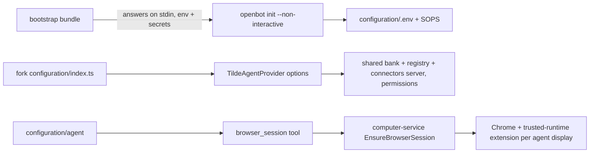

# Hosted exe-dev init, shared agent resources, and Computer browser runtime

# Intent of the change

Hosted instance must init itself on an exe.dev VM from a control-plane bootstrap bundle. Before, `openbot init --non-interactive` rejected `runtime: exe-dev`, always asked for a Vercel token and the Code Storage organization key. Now init accepts `runtime: exe-dev`, a preseeded `AI_GATEWAY_API_KEY` (no Vercel platform question), and a preseeded `CODE_STORAGE_REPOSITORY_TOKEN` (stored as-is, no organization key). Scaffold unchanged: Factory agent plus Memory Catcher.

Tilde agent provider gains one opt-in extension point set from the fork composition root: `new TildeAgentProvider(tilde, { sharedResources, permissions })`. `sharedResources` shares one memory bank, skill registry (union of every authored agent's skills), and connectors MCP server (personal tool federation `all`) across agents; `permissions` resolves each agent's reach from `{ id, kind, subagentIds, ownerUserId }` where the owner is `OPENBOT_OWNER_USER_ID` or the `owner_user_id` Tilde records on the bundle. Default off: every agent keeps its own resources, permissions never set. Primary reconciles before subagents.

Computer's Chrome becomes a self-hosted Tilde browser runtime: trusted-runtime extension vendored on disk, Chrome launched per agent display with `--load-extension` and a loopback DevTools port, `EnsureBrowserSession` RPC bootstraps the extension over CDP, `browser_session` agent tool exposes it.

An initialization test replays a hosted bootstrap bundle (answers, environment, secrets) through non-interactive init and asserts the composition, `.env`, encrypted secrets, and scaffolded agents.

# Architecture changes

New provider option contract in `@tryopenbot/agent-provider` `src/core.ts` (ADR-0039) and Computer browser runtime (ADR-0040). Provider boundaries unchanged: agent provider still owns every agent's external footprint; fork composition root owns what is shared and who may reach whom; browser runtime is a Computer concern, not a provider or agent concern.

# Summarized package changes

- `openbot` (cli): `exe-dev` allowed non-interactively; init passes its process environment to provider initialization; `tools/browser_session.ts` in the agent template; agent template connects the shared connectors server when `OPENBOT_SHARED_CONNECTORS_MCP_SERVER_ID` is set; lifecycle reconciles the primary before subagents; hosted exe-dev init test.
- `@tryopenbot/inference-provider`: `VercelInferenceProvider` accepts `{ preseededEnvironment }`; a preseeded `AI_GATEWAY_API_KEY` drops the Vercel platform dependency and questions.
- `@tryopenbot/git-provider`: Code Storage init persists a preseeded repository token without the organization key.
- `@tryopenbot/agent-provider`: `AgentProviderOptions` (`sharedResources`, `permissions`), `ReconciledAgent`, `sharedAgentResourceEnvironment`; owner from `OPENBOT_OWNER_USER_ID` or the bundle's `owner_user_id`.
- `@tryopenbot/computer-service-proto`: `EnsureBrowserSession` RPC.
- `@tryopenbot/computer-service`: browser session manager, CDP bootstrap, Tilde browser session registry.
- `@tryopenbot/computer-service-provider`: vendored extension with `PROVENANCE.md`, Chrome launch flags, managed Chrome policy, host Computer receives the Tilde tenant.
- `@tryopenbot/computer-tools`: `browser_session` tool.
- Docs: ADR-0039, ADR-0040, `docs/agents.md`, package READMEs, changeset `add-hosted-init-and-browser-runtime`.

# Critical to apply to forks

no. Installations keep their current behavior: the provider only shares resources or sets permissions when the fork's `configuration/index.ts` passes options. Forks that render agents from their own template gain `tools/browser_session.ts` as a new required template file on the next scaffold; run `openbot init` again or add the file from `cli/src/assets/agents/factory/tools/browser_session.ts.hbs`. Forks that build a custom Computer image pick up the vendored extension and Chrome policy when they rebuild. Forks wanting one shared memory, registry, and connectors server across their agents opt in through `AgentProviderOptions` and must record `OPENBOT_AUTOMATIC_MEMORY_MODE=personal_plus_agent` in `configuration/.env`; the provider sets no memory default and fails before provisioning when a shared bank is configured without it.
