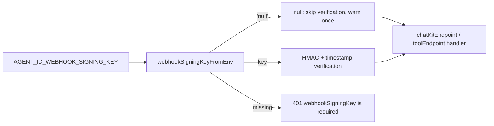

# Allow skipping webhook signature verification with an explicit null key

## Intent of the change

Every Tilde HTTP-agent endpoint built with `@trytilde/sdk-vercel-ai-node` required a webhook signing key and rejected any invocation whose `x-tilde-signature` did not match. A public agent endpoint whose network path already authenticates Tilde had no supported way to run without that check.

`webhookSigningKey` on `chatKitEndpoint`, `toolEndpoint`, and `verifyWebhookRequest` is now `string | null`. An explicit `null` skips verification entirely: no signature headers are required, no timestamp tolerance is enforced, and the SDK emits one `console.warn` per process saying the endpoint accepts unsigned invocations. `undefined` or an empty key keeps the previous behavior (`webhookSigningKey is required`), so verification is never skipped by accident.

Generated agents read `AGENT_<ID>_WEBHOOK_SIGNING_KEY` through the new `webhookSigningKeyFromEnv` helper. Setting that variable to the literal value `null` passes the explicit `null`; any other value is the key and a missing value stays required.

## Architecture changes

No ownership boundary moves. Verification stays inside the SDK and the opt-out is a per-endpoint option that authored code sets deliberately. `@trytilde/sdk` never verified webhooks (it only returns the issued key from agent registration) and is unchanged. The agent provider treats a literal `null` as configured credentials, so it neither regenerates nor overwrites the secret.

## Summarized package changes

- `@trytilde/sdk-vercel-ai-node`: `VerifyWebhookOptions.webhookSigningKey` is `string | null`; `verifyWebhookSignature` returns the raw body with a best-effort `webhookId` and `timestamp` when the key is `null`; `chatKitEndpoint` and `toolEndpoint` warn once at construction and log `webhook accepted unsigned` with `signatureVerified: false`; new exports `webhookSigningKeyFromEnv` and `UNSIGNED_WEBHOOK_ENV_VALUE`; README section on signature verification.
- `@trytilde/sdk-vercel-ai-node` tests: skip-with-null (including tampered signature and stale timestamp), error-with-undefined and empty key, once-only warning, environment mapping, and unchanged signed verification for both endpoints.
- `openbot` (cli): the Factory and Memory Catcher `agent.ts.hbs` templates pass `webhookSigningKeyFromEnv(process.env.AGENT_<ID>_WEBHOOK_SIGNING_KEY)`.
- Docs: `docs/agents.md` records the `null` environment convention; changeset `allow-unsigned-webhook-verification`.

## Critical to apply to forks

no. Default behavior is unchanged: existing agents keep verifying signatures with their issued key, and a missing key still rejects every request. Forks that render agents from their own template may adopt `webhookSigningKeyFromEnv` to gain the `null` convention; forks that keep `process.env.AGENT_<ID>_WEBHOOK_SIGNING_KEY!` continue to work and simply cannot opt out through the environment.
