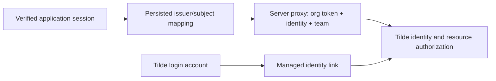
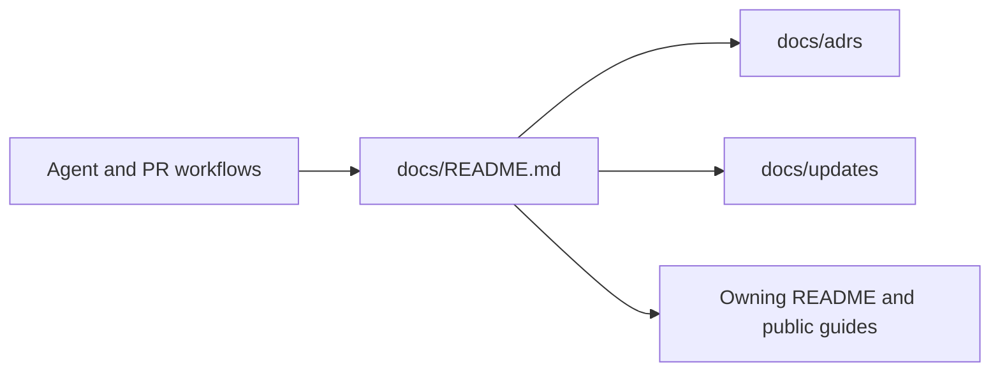

# Org identity SDK and shared runtime proxy

PR: https://github.com/trytilde/dispatch/pull/153

## Intent of the change

Let independently authenticated applications provision identities and securely proxy runtime requests under immutable identity/team context.

## Architecture changes

Identity decision: [0042-org-runtime-identities.md](../adrs/0042-org-runtime-identities.md).

Governing decision: [0041-repository-documentation-convention](../adrs/0041-repository-documentation-convention.md).
The documentation convention preserves runtime architecture; the identity/authentication changes below establish separate account and runtime authorities.

## Summarized changes

- Replaced identity and membership offset lists with standard cursor pages (`pageSize`/`nextPageToken`, `{ items, next_page_token }`), preserving opaque cursors and the 1–100 page-size contract.
- Added identity CRUD/lookup/identifier removal, team membership management, initial-team provisioning, managed linking, immutable runtime clients, and the Fetch proxy.
- Prevented application credential leakage through redirects on handwritten and generated transports; froze context and copied headers across concurrent requests.
- Added CSP sandbox/nosniff protection to proxied active content and explicit rejection of unsupported gRPC delegation.
- Regenerated the full wallet-enabled OpenAPI clients with native org/team onboarding, account recovery state, cursor list responses, explicit account/proxy security schemes, and nonduplicated path parameters. Existing wallet routes omitted by the default feature build are now represented in the generated contract.
- Updated SDK/public documentation, Changesets, ADRs, and the common agent/PR documentation workflow.
- Validation: `pnpm check` passed with 39 existing warnings; `pnpm build` passed. `TILDE_API_DIR=... pnpm openbot sdk refresh` passed all 291 SDK-family tests, including 126 core SDK tests and 151 Vercel AI Node tests. `pnpm openbot sdk smoke` passed a clean packed consumer build/run.
- Cross-client parity: no Dispatch application UI capability changed; server-only application delegation is a shared SDK surface. No new external dependencies, protobuf contract changes, or internal metadata semantics were introduced. Tracked upstream configuration remains only `configuration/.gitignore`.
- Follow-up review blocks durable agent credential registration at the proxy before forwarding; the expanded core SDK suite passes 126 tests, including preserved MCP session/protocol headers.
- HeyAsh verified real Clerk-signed sessions and proxy isolation against the local API. Complete Google login/provider flows and coordinated npm publication remain outstanding; no production deployment is included in this PR.

## Critical to apply

yes

Publish coordinated SDK/API-client versions and deploy the matching Tilde API before using the new exports. Source version metadata and peer ranges were aligned to already-published registry versions using npm version/pkg tooling; the new Changesets plan advances SDK/API-client to 0.3.0 and the React/Vercel adapters to 2.0.0 without reusing existing versions. No npm publication was performed.
