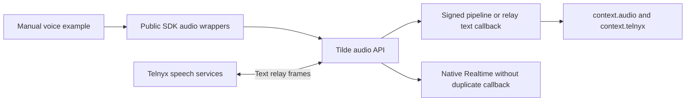

# PR 155: ChatKit realtime voice SDK

https://github.com/trytilde/dispatch/pull/155

## Intent of the change

Expose the companion Tilde voice API through the current public SDK packages and
provide a manually runnable browser/Telnyx agent example, including carrier-owned
recognition and synthesis through Telnyx Conversation Relay.

## Architecture changes

ADR review: ADR 0030 records SDK ownership and now documents the relay adapter
contract. The API's ADR 0027 governs agent-owned speech configuration. Typed signed speech
context is validated before it reaches the ordinary endpoint callback.

## Summarized changes

- SDK: agent audio registration/configuration, retrieval, browser admission, and
  Telnyx route binding using camelCase inputs and the API's typed wire fields.
- Node adapter: verified speech context, current-user-turn context selection, and
  interrupted generated-speech annotations during history conversion.
- Relay: third mode, language and interruptible settings, phone-only admission,
  and carrier-reported spoken-prefix annotations for both text and UI history.
- Example: three agents, current package names and AI SDK 7, explicit agentLoop
  response mode, local microphone/player, and carrier setup instructions.
- Package READMEs and minor Changeset for both public SDK packages.
- No application client, provider composition, protobuf, or fork configuration changes.
- Generated contracts were refreshed from the full wallet-enabled API after
  integrating current provider and direct-workflow changes in both repositories.
  The schema contains 732 operations, adds seven voice operations, removes none,
  and preserves all 22 existing wallet/payment operations.

Validation: `pnpm openbot sdk refresh` passes all SDK package builds and 327 tests.
The current core SDK and Node adapter separately pass their typechecks and 313
focused tests. The manual example typechecks. Scoped lint previously passed with
existing warnings in unchanged webhook tests. API proof includes the actual
Telnyx text/control runtime against HTTP/Postgres and live OpenAI pipeline/native
inference; it does not establish a real Telnyx call. Public docs validation,
broken links, accessibility, and publication-boundary checks pass. Full Dispatch
application checks/builds and real carrier/browser interactions were not run for
this isolated SDK contribution.

## Critical to apply

yes

Deploy API PR 277 with its migrations and voice routes, then release these SDK
packages and publish docs PR 37. The generated client and hand-authored audio
wrappers both include the voice operations. Existing endpoints need the updated
Node adapter to recognize `telnyx_relay` context.

Speech configuration is portable agent intent; credentials stay server-side and
example registration secrets are ignored. Media tokens are ephemeral. Telnyx
routing is installation-specific. Its real ChatKit channel supports self-managed
or managed webhook setup with existing customer credentials/application/number;
managed setup does not purchase or fund carrier resources. Native endpoint-tool bridging, browser
personal-tool federation, direct WebRTC/SIP, ElevenLabs, recordings, and voice
notes are outside this slice.

Related: https://github.com/trytilde/api/pull/277 and
https://github.com/trytilde/docs/pull/37.
