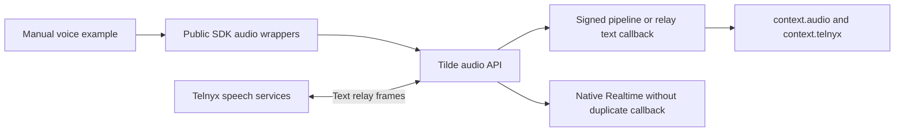

# PR 155: ChatKit realtime voice SDK

https://github.com/trytilde/dispatch/pull/155

## Intent of the change

Expose the companion Tilde voice API through the current public SDK packages and
provide a manually runnable browser/Telnyx agent example, including carrier-owned
recognition and synthesis through Telnyx Conversation Relay.

## Architecture changes

ADR review: ADR 0030 records SDK ownership and now documents the relay adapter
contract. The API's ADR 0025 governs agent-owned speech configuration. Typed signed speech
context is validated before it reaches the ordinary endpoint callback.

## Summarized changes

- SDK: agent audio registration/configuration, retrieval, browser admission, and
  Telnyx route binding using camelCase inputs and the API's typed wire fields.
- Node adapter: verified speech context, current-user-turn context selection, and
  interrupted generated-speech annotations during history conversion.
- Relay: third mode, language and interruptible settings, phone-only admission,
  and carrier-reported spoken-prefix annotations for both text and UI history.
- Example: three agents, current package names and AI SDK 7, explicit agentLoop
  response mode, local microphone/player, and carrier setup instructions.
- Package READMEs and minor Changeset for both public SDK packages.
- No application client, provider composition, protobuf, or fork configuration changes.
- Generated contracts are intentionally not replaced with the older API branch
  snapshot. After API PR 277 is rebased, regenerate from its complete current-main
  contract before release; no generated file was hand-edited.

Relay revision validation: both SDK package typechecks and builds pass, as do
all 132 SDK tests and 159 Node-adapter tests. Focused coverage includes relay
configuration defaults/round trips, optional channel response mapping, signed
callback context, and interrupted
text/UI history. Scoped lint passes with six existing warnings in unchanged
webhook tests. The manual example typechecks. Public Mintlify checks pass in
docs PR 37. Full application checks/builds and live carrier calls were not run
for this isolated SDK contribution. Prior OpenAI inference evidence belongs to
the API worktree; it does not establish live Telnyx Relay behavior.

## Critical to apply

yes

Resolve/revalidate API PR 277, refresh the complete generated contract from that
API head, deploy its migrations and voice routes, then release these SDK packages
and publish docs PR 37. The raw generated API client does not yet expose the new
voice operations in this draft; the hand-authored wrappers implement them.

Speech configuration is portable agent intent; credentials stay server-side and
example registration secrets are ignored. Media tokens are ephemeral. Telnyx
routing is installation-specific. Its real ChatKit channel supports self-managed
or managed webhook setup with existing customer credentials/application/number;
managed setup does not purchase or fund carrier resources. Native endpoint-tool bridging, browser
personal-tool federation, direct WebRTC/SIP, ElevenLabs, recordings, and voice
notes are outside this slice.

Related: https://github.com/trytilde/api/pull/277 and
https://github.com/trytilde/docs/pull/37.
