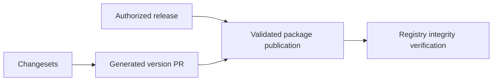

# Describe the actual Changesets release workflow

PR: https://github.com/trytilde/dispatch/pull/157

## Intent of the change

Prevent agents from treating a version PR merge as proof of npm publication.
The repository workflow generates version PRs and has no publish command.

## Architecture changes

ADR review: no new decision. This corrects skill wording to match the existing
release workflow and package artifact validation requirements.

## Summarized changes

- Correct the version-only CI description and remove instructions to assume npm
  publication or GitHub releases occur after merging.
- Explain authorized publication, pnpm-packed workspace artifacts, required
  browser authentication, registry verification, and release-record updates.
- Checked against the current Changesets workflow; skill and diff checks passed.
- No package code or release versions change; this documentation-only update
  requires no Changeset under the existing skill policy.

## Critical to apply

no

No runtime or deployment action. Future releases must report verified publication
separately from source merges and successful authentication.
