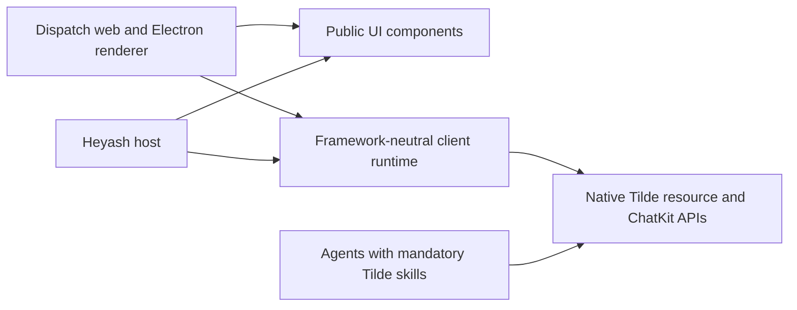

# Reusable Dispatch UI and native resource workflows

PR: https://github.com/trytilde/dispatch/pull/158

## Intent of the change

Make Dispatch's chat, settings and connection UI reusable by Heyash without copying
components or moving host branding into Dispatch. Replace capability proposals
with native permission-controlled operations and managed Tilde skills.

## Architecture changes

See [ADR 0044](../../adrs/0044-reusable-kit-and-direct-resource-workflows.md) and
[ADR 0023](../../adrs/0023-workspace-ui-package-owns-presentation.md).

Web and Electron consume the same renderer and runtime. The port is included
through that shared path; browser opening, downloads and native return URLs stay
platform adapters. Upstream configuration retains only configuration/.gitignore.

## Summarized changes

- Public settings shells, filters, form primitives, dialogs, screen states and
  composable routine/provider rows; all catalog stories import public exports.
- Shared prompt/draft/upload state, floating composer, embedded queue, circular
  attachment previews, session header/participants, scoped find with older-history
  loading, day separators, and message/event separation.
- One generic tool-call presentation for summaries and full details; batch wrappers
  expand to inner calls. Removed unused timeline, approval and demo surfaces.
- Connection continuation handles forms, instructions, OAuth polling, cancellation,
  retries and downloads without persisting credentials. Settings uses the same
  controller as chat. Provider-only hosts omit account/MCP assignment UI.
- Native All/Personal/Bots inventories; optimistic assignment rollback, refresh
  ownership and personal account deletion retain resource scope and caller authority.
- Retired proposal SDK/control/UI/template APIs. Every provisioned agent receives
  the Tilde resource skills and managed enable-connections process. History search
  is available through native session-scoped MCP, including restricted synthesis.
- Validation: runtime 174 tests, UI 78 tests, agent provider 17 tests, scaffold
  10 tests, native bridge 2 tests and both settings browser workflows passed.
  SDK regeneration/build/tests, full workspace build and package/CLI artifact
  verification pass on the integrated upstream baseline. Workspace check reports
  zero errors and 41 warnings. OAuth and managed credential stories open their
  dialogs without browser errors; media attachments open the shared gallery.
- Public workflow documentation: https://github.com/trytilde/docs/pull/38 (merged).
  The generated contract preserves the wallet and custom-provider surfaces while
  removing eight proposal routes and adding the two resource inventory routes.

## Critical to apply

yes

Deploy the matching Tilde resource-inventory, connector-event and history contracts
with consumers; retire proposal callers before applying the proposal-removal
migrations. Regenerate agent bundles to install mandatory skills. Heyash must
refresh its built artifacts and lockfile together. This change publishes no npm
packages and performs no manual deployment or production migration.
