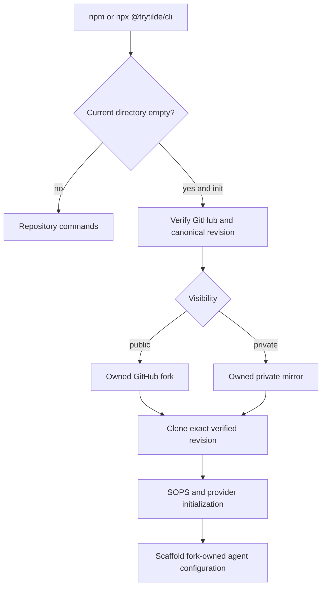

# PR 38: Publish Dispatch packages and standalone CLI

## Intent of the change

- Make every workspace package public. Use `@trytilde/dispatch-*` namespace.
- Keep the operator command simple: package `@trytilde/cli`, executable `tilde`.
- Ship real JavaScript, declarations, CSS, Handlebars assets, service binaries, and verified package exports. No source-checkout dependency at runtime.
- Let `tilde init` start in empty directory. Create owned GitHub public fork or private mirror. Support personal account and organization through `name` or `owner/name`.
- Make automation first class. JSON answers on stdin. JSON results on stdout. Secret values on stdin, never argv.
- Make AWS IAM Identity Center profiles work with SOPS. Export fresh short-lived credentials through AWS CLI and pass only to child process environment.
- Keep local computer images local. Build Vercel Sandbox image for `linux/amd64` and publish to configured Vercel Container Registry.

## Architecture changes

- Package boundary changes from private TypeScript workspace links to dual development/published exports.
- Development condition points at `src`. Published condition points at `dist`. Build verifies every declared artifact.
- CLI root changes from install checkout to current working directory. Ordinary commands operate on current Dispatch repository. Init is special: empty destination becomes repository root after verified clone.
- Repository bootstrap checks empty directory, Git, GitHub auth, SSH, canonical HEAD compatibility, fork or mirror creation, exact cloned revision, and origin/upstream remotes before configuration begins.
- Public path remains GitHub fork. Private path remains independent mirrored repository. No false private-fork claim.
- SOPS identity metadata may store AWS profile name. It never stores exported access key, secret key, or session token.
- Provider ownership stays same. Microsandbox owns local image use. Vercel Sandbox owns registry question, Buildx platform, push, and deployment environment output.

## Summarized package changes

- `@trytilde/cli`: public executable package; bundled `dist/index.js`; empty-directory repository bootstrap; organization repositories; non-interactive JSON init; JSON agent and secret mutations; stdin secrets; SOPS encryption preflight; fresh AWS profile export; current-directory operation.
- `@trytilde/dispatch-workspace`: public workspace identity; renamed scripts and filters; full artifact and standalone executable verification.
- `@trytilde/dispatch-ui` and `@trytilde/dispatch-web`: published UI JavaScript, declarations, CSS, and corrected Beautiful UI stylesheet resolution.
- `@trytilde/dispatch-control-service` and `@trytilde/dispatch-computer-service`: runnable service artifacts; computer service exposes executable bin; control service publishes declarations and root export.
- `@trytilde/dispatch-control-service-proto` and `@trytilde/dispatch-computer-service-proto`: generated JavaScript/declarations and proto sources included in public packages.
- `@trytilde/dispatch-agent-provider`, `@trytilde/dispatch-inference-model-provider`, `@trytilde/dispatch-skills-provider`, and `@trytilde/dispatch-tools-provider`: public provider exports renamed and built to `dist`.
- `@trytilde/dispatch-agent-service-provider`, `@trytilde/dispatch-control-service-provider`, and `@trytilde/dispatch-computer-provider`: public provider artifacts, templates, declarations, and renamed cross-package imports.
- `@trytilde/dispatch-runtime-provider`: initialization questions may include descriptions for interactive and automated clients.
- `@trytilde/dispatch-configuration`: public typed fork composition contract under new namespace.
- `@trytilde/dispatch-utilities`: public JavaScript/declarations and copied Handlebars assets.
- `@trytilde/dispatch-desktop`: public package metadata and renamed web dependency; Linux AppImage and Debian packaging verified.
- Changesets fixed group and all existing pending changesets now use published package names. New release changeset covers public artifacts, CLI, AWS profile refresh, and automation surface.
- Governing ADRs and package READMEs updated. Protobuf schemas and `tilde.state.yaml` unchanged.

## Critical to apply to forks

yes

- Replace every `@dispatch/*` dependency and import with the matching `@trytilde/dispatch-*` name. Replace `@dispatch/cli` with `@trytilde/cli` and invoke it as `tilde`.
- Run `pnpm install`, `pnpm check`, `pnpm build`, and provider-focused tests after namespace migration. Published consumers must import declared exports, not package `src` paths.
- Use `tilde <command>` or `npx @trytilde/cli <command>`. Run new initialization only from completely empty destination. Existing initialized forks keep their tracked configuration and do not rerun init in place.
- For organization repository creation, answer `owner/name`. Bare name still uses authenticated GitHub account.
- AWS KMS owners using a named profile must have AWS CLI credential export working. Profile name remains in `configuration/sops.identity.json`; fresh credentials remain ephemeral.
- Vercel Sandbox forks must provide untagged Vercel Container Registry repository and have Docker Buildx available for `linux/amd64`. Local Microsandbox forks no longer need `DISPATCH_COMPUTER_IMAGE_REPOSITORY`.
- Automation should send init answers as JSON on stdin and secret values through `--stdin`; never put credentials in command arguments.
- Keep upstream contribution boundary intact: canonical repository tracks only `configuration/.gitignore`. Forks keep initialized `configuration/` and exclude `configuration/.env`.
