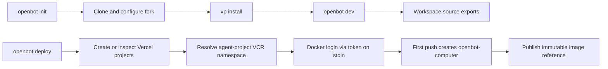

# Intent of the change

- Fresh fork should finish init ready to run.
- Init always runs `vp install` after configuration succeeds.
- Dev server should load workspace package source. No prior package build needed.
- Vercel user should give project names, not manually create or paste image repository.
- Vercel projects configure first. Computer image push then creates project-owned VCR repository.

# Architecture changes

- Build remains local and content-addressed.
- Deploy remains provider-coordinated: every `configure()` completes before any `deploy()`.
- Vercel computer provider owns registry discovery, authentication, and repository creation.
- `VERCEL_TOKEN` stays deployment-only. It is not written to configuration, arguments, logs, or runtime state.
- Local Microsandbox behavior does not change.

# Summarized package changes

- `openbot`
  - Remove `computer-image-repository` from Vercel init answers.
  - Run `vp install` as final successful init action.
  - Add `--conditions=development` to watched server process while preserving existing `NODE_OPTIONS`.
  - Add regression coverage for init and source-export resolution.
- `@tryopenbot/computer-provider`
  - Suppress registry prompt for managed Vercel images.
  - Use local build tag before remote project configuration exists.
  - Resolve `vcr.vercel.com/<scope>/<agent-project>/openbot-computer` during deploy.
  - Authenticate Docker with Vercel token through stdin.
  - Let first push create repository, then publish immutable content tag.
- Documentation
  - Amend ADR-0006 with provider-owned VCR lifecycle.
  - Update root, CLI, configuration, and computer-provider guidance.
- Release
  - Add fixed-workspace patch changeset.
- Proof
  - Computer-provider tests: 15 passed.
  - CLI tests: 32 passed, 2 skipped.
  - `pnpm check` passed with existing warnings only.
  - `pnpm build` passed, including package artifacts and standalone CLI smoke test.
  - Real `/root/our-openbot` source import passed without package `dist` artifacts.

# Critical to apply to forks

yes

- Pull this update before initializing a new fork. Init will install dependencies automatically.
- Existing initialized forks cannot rerun init. Run `vp install` once after pulling.
- Existing Vercel forks may remove stale `COMPUTER_IMAGE_REPOSITORY`; it is no longer an init input.
- Ensure the Vercel token can access the configured agent project and VCR.
- Next deploy creates `openbot-computer` inside the agent project's VCR on first push.
- Run `openbot dev` to verify workspace packages resolve from source without a full build.
