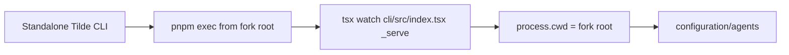

# Intent of the change

- Make standalone `tilde dev` discover agents from the fork repository.
- Stop `pnpm --filter @trytilde/cli exec` from changing the watched server cwd to `cli/`.
- Fix `ENOENT` for `<fork>/cli/configuration/agents` on the first development run.

# Architecture changes

- No provider or deployment topology changes.
- The child process now preserves the CLI's existing repository-root boundary.

# Summarized package changes

- `@trytilde/cli`
  - Launch the watched server with root-scoped `pnpm exec`.
  - Keep `cli/src/index.tsx` as the source entrypoint.
  - Add a regression assertion for the exact command.
- Release
  - Add fixed-workspace patch changeset.
- Proof
  - CLI typecheck passed.
  - CLI tests passed: 39 passed, 2 skipped.
  - Real run from `/root/our-dispatch` passed the reported agent discovery failure.

# Critical to apply to forks

yes

- Pull this fix before running the standalone CLI against a source fork.
- No configuration or secret migration is required.
- Retry `tilde dev`; it will read `<fork>/configuration/agents` rather than `<fork>/cli/configuration/agents`.
