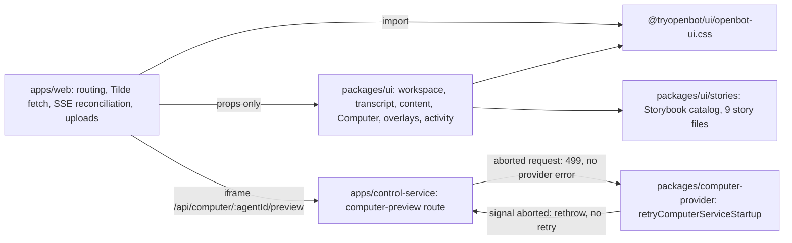

# Intent of the change

- Ship the continuous agent workspace: sidebar, transcript, composer, rich message content, Computer pane, overlays, activity panels.
- One continuous conversation per agent. No session picker, no thread list, no conversation switcher.
- Move every reusable surface out of `apps/web` into `@tryopenbot/ui`. The app keeps data fetching, routing, and composition only.
- Ship the workspace stylesheet from the package as `@tryopenbot/ui/openbot-ui.css`. No app-local stylesheet.
- Make every reusable component inspectable in isolation. Package-owned Storybook, not a separate demo app, not duplicated production components.
- Stop treating an owner-cancelled Computer preview as a provider failure. A hidden or unmounted preview is normal lifecycle.

# Architecture changes

- Presentation boundary moved. `packages/ui` owns markup, class names, motion, and component state. `apps/web` owns the Tilde data path and application composition. Nothing in `packages/ui` fetches.
- Stylesheet ownership moved with it. `apps/web/src/styles.css` is deleted; `packages/ui/src/openbot-ui.css` is the single workspace stylesheet, exported through a new `./openbot-ui.css` entry in the package `exports` and `publishConfig.exports`. `apps/web/src/main.tsx` imports the package path.
- Four modules physically relocated: `agent-workspace-panel.tsx`, `use-workspace-layout.ts`, `message-content.tsx`, `styles.css` → `packages/ui/src/`. Git records them as renames; GitHub's file list shows the CSS and `message-content.tsx` as delete plus add.
- Computer preview lifecycle is now two-sided. The panel mounts the iframe only while the pane is visible and re-keys it on retry and monitor switch; the control-service route returns `499` when `context.req.raw.signal.aborted`; `retryComputerServiceStartup` rethrows instead of retrying when `signal?.aborted`. No provider error surfaces from an owner navigating away.
- Computer screen focus decoupled from agent identity. `AgentWorkspacePanel` tracks `activeMonitorId` locally and derives `previewUrl`, `previewAgentId`, and `previewAgentName` from the selected monitor, falling back to the agent. Selecting a monitor drops control, resets ready and failure state, and re-keys the iframe. The monitor strip renders only when more than one monitor exists.
- Preview failure is a UI state, not a blank frame. `ComputerStagePlaceholder` covers booting and unreachable, with a retry action that bumps the preview key.
- Chat event replay is deduplicated in the app, not the package. `apps/web/src/screens/openbot-app.tsx` keeps a bounded `Set` of seen event ids, evicting the oldest past 1000 entries.
- Storybook is package-owned. `packages/ui/.storybook/main.ts` uses `@storybook/react-vite` plus the Tailwind Vite plugin; `preview.tsx` loads both package stylesheets and wraps stories in `openbot-storybook-root`. Stories import the real exports; no duplicate production components exist.
- Not in this PR: no protobuf, no persisted schema, no deployment resource, no environment name, no secret handling. Streamed chat state, uploads, and preview URLs stay ephemeral runtime data.

# Summarized package changes

- `packages/ui` — the bulk of the change. New modules: `workspace-shell.tsx`, `workspace-sidebar.tsx`, `sidebar-components.tsx`, `workspace-icons.tsx`, `chat-components.tsx`, `chat-composer.tsx`, `transcript-components.tsx`, `rich-message-components.tsx`, `content-components.tsx`, `markdown-components.tsx`, `primitive-components.tsx`, `overlay-components.tsx`, `computer-components.tsx`, `computer-stage.tsx`, `activity-panels.tsx`, `agent-activity.tsx`, `agent-avatar.tsx`, `agent-avatar-shapes.ts`, `assets/avatars/{blue,green,red}.svg`. Relocated in: `agent-workspace-panel.tsx`, `use-workspace-layout.ts`, `message-content.tsx`, `openbot-ui.css` (7249 lines). `index.ts` +199 export lines. `README.md` rewritten around the public component surface and the Storybook command. `package.json` gains the `./openbot-ui.css` export, `storybook` and `storybook:build` scripts, Storybook/Tailwind devDependencies, and `react-markdown` + `remark-gfm` dependencies. One unit test file, `computer-components.test.ts`, covering `getComputerRebuildProgress` phase mapping, reset cleanup ordering, the four-step recovery flow, and clamping of image-download progress.
- `packages/ui/stories` — 9 new story files: `Workspace`, `Messages`, `Computer`, `Content`, `Activity`, `Controls`, `Transcript`, `Overlays`, `Primitives`.
- `apps/web` — `screens/openbot-app.tsx` rewritten around the package components (364 added, 559 removed) with the replayed-event dedupe; `main.tsx` swaps `./styles.css` for `@tryopenbot/ui/openbot-ui.css`; `chat-api.ts` adds optional `last_message_preview` and `last_user_message_at` to `ChatAgent` for sidebar preview rows; `styles.css` and `message-content.tsx` removed.
- `apps/control-service` — `computer-preview.ts` returns `499` on an aborted request; `app.test.ts` adds a case asserting the aborted preview yields `499` and still calls `previewAgentDesktop` once.
- `packages/computer-provider` — `base/index.ts` rethrows on an aborted signal inside `retryComputerServiceStartup`; `base.test.ts` adds a case asserting a caller-aborted request is attempted once and not retried.
- `tests/e2e/workspace.spec.ts` — 270 added lines across 6 Chromium tests: owner-session requirement, bare workspace layout metrics, mobile-viewport chat composition, rich streaming plus file upload, queued turn while busy, control-route health.
- `scripts/copy-package-assets.mjs` — copied extensions gain `.svg` so packaged avatar artwork ships in `dist`.
- `.gitignore` — `storybook-static/`.
- `.changeset/extract-workspace-ui.md`, `.changeset/add-rich-content-surfaces.md` — both minor. The first bumps the whole fixed workspace group; the second is `@tryopenbot/ui` only.
- `pnpm-lock.yaml` — 2221 added lines for the new UI and Storybook dependency graph.
- No ADR, no `docs/` change in this PR.

# Critical to apply to forks

yes

**A fork that styled the web app loses its stylesheet.** `apps/web/src/styles.css` is deleted, 3680 lines, and reappears as `packages/ui/src/openbot-ui.css`. A fork that edited the app stylesheet sees the file vanish on merge. Reapply the edits in `packages/ui/src/openbot-ui.css`, or add a fork-owned stylesheet imported after the package one — do not restore `apps/web/src/styles.css`, because `apps/web/src/main.tsx` no longer imports it.

**Import paths moved.** `apps/web/src/message-content.tsx`, `apps/web/src/agent-workspace-panel.tsx`, and `apps/web/src/use-workspace-layout.ts` are gone. Anything in a fork importing `./message-content.js`, `../agent-workspace-panel.js`, or `./use-workspace-layout.js` from inside `apps/web` fails to resolve. Import `MessageContent`, `AgentWorkspacePanel`, and `useWorkspaceLayout` from `@tryopenbot/ui`.

**`apps/web/src/screens/openbot-app.tsx` was rewritten.** 364 added, 559 removed. A fork carrying local edits to the workspace screen will conflict across most of the file. Rebase by re-expressing the fork's behavior as props into the package components rather than by resolving hunks.

**Install before anything else.** `@tryopenbot/ui` gained runtime and Storybook dependencies and the lockfile changed by 2221 lines. Run `pnpm install`; a stale `node_modules` fails at build, not at typecheck.

**Packaged asset copying changed.** `scripts/copy-package-assets.mjs` now copies `.svg`. A fork with its own package build or asset pipeline must copy the avatar SVGs under `packages/ui/src/assets/avatars/` or agent identity artwork is missing from `dist` in production builds only.

**Cancelled Computer previews are no longer errors.** The control-service preview route returns `499` for an aborted request and `retryComputerServiceStartup` no longer retries a caller-aborted call. A fork asserting a `5xx` status on abort, counting retry attempts through cancellation, or alerting on aborted preview requests must update those expectations. This is silent at typecheck.

**Storybook output is ignored.** `storybook-static/` is in `.gitignore`. A fork that published that directory from the repository must adjust.

**Additive only on the chat contract.** `ChatAgent` gained optional `last_message_preview` and `last_user_message_at`. No protobuf, persisted schema, environment name, or secret handling changed. No migration.

Run `pnpm install`, then `pnpm check`, `pnpm build`, `pnpm --filter @tryopenbot/ui storybook:build`, and `pnpm test:e2e`. Then open the workspace and confirm the sidebar, transcript, composer, overlays, activity panels, and Computer pane render — the relocation is invisible to static checks once imports resolve.
