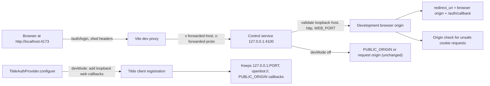

# Intent of the change

- Local login must stay on browser origin. Before, dev login sent `redirect_uri` from persisted production `PUBLIC_ORIGIN`, so Tilde returned owner to deployed control service, not local one.
- Keep `localhost` and `127.0.0.1` apart. PKCE state and verifier cookies are host-only, so forcing one host kills a session started on other host.
- Dev proxy must carry real browser origin. Vite rewrites upstream URL to `127.0.0.1:4100`, so control service alone cannot see `4173`.
- Cookie-authenticated mutations must trust same validated dev origin. Otherwise login works, later local `POST` gets `403`.
- Tilde dev registration must know both loopback web callbacks, while deployment callback stays.
- Production behavior must not move. No new persisted variable, no route change, no audience change.

# Architecture changes

- Boundary owners unchanged. Control service owns callback resolution and origin validation. Auth provider owns Tilde OIDC client registration. No new service, no new provider role.
- New seam is narrow: `developmentBrowserOrigin(context, environment)` inside `apps/control-service/src/auth.ts`. It accepts forwarded origin only when all hold: `devMode` true, first `x-forwarded-proto` is `http`, host is `localhost` / `127.0.0.1` / `[::1]`, port equals `WEB_PORT` or `4173`. Anything else falls back to control-service request origin, so trust never widens.
- `registerOwnerAuth` and `requireOwner` now take `OwnerAuthOptions` (`devMode`, `environment`) from `createApp` options instead of reading `process.env` inline. Same values reach `callbackUrl`, `cookieOptions`, `trustedCookieMutation`, `authenticate`, `setTokenCookies`.
- Cookie `Secure` still derives from resolved callback scheme, so HTTPS deployment keeps `Secure`, loopback `http` correctly drops it.
- ADR-0016 already fixes this model (PKCE, host-only cookies, "Secure outside loopback development", Origin match on unsafe cookie requests). No new ADR. No protobuf, no ConnectRPC, no HTTP route added or removed.

# Summarized package changes

- `@tryopenbot/control-service`
  - `src/auth.ts`: add `OwnerAuthOptions`, thread options through login, callback, session, logout, middleware, cookie helpers. Add `developmentBrowserOrigin`. `callbackUrl` prefers validated dev browser origin when `devMode`, else `PUBLIC_ORIGIN`, else request origin.
  - `src/app.ts`: pass app options into `registerOwnerAuth` and `requireOwner`.
  - `src/auth.test.ts`: two new tests — dev login keeps `redirect_uri` on forwarded `localhost:4173` even with hosted `PUBLIC_ORIGIN` and sets no `Secure` cookie; dev mutation accepts forwarded local origin and rejects `https://evil.test` with `403`. Env stubs cleared in `afterEach`.
  - `test/e2e-server.ts`: harness app runs with `devMode: true`, and stub `authorizationUrl` echoes `redirect_uri` so browser test can assert it.
  - `README.md`: document `createApp`, `registerOwnerAuth`, `requireOwner`.
- `@tryopenbot/auth-provider`
  - `src/tilde.ts`: `#register` takes `development` from `context.devMode`; when set, adds `http://127.0.0.1:<WEB_PORT>/auth/callback` and `http://localhost:<WEB_PORT>/auth/callback`. Loopback control callback, `openbot://auth/callback`, and `PUBLIC_ORIGIN` callback stay. `deployment_url` untouched.
  - `src/tilde.test.ts`: dev reconciliation registers both loopback web callbacks and keeps hosted callback.
  - `README.md`: add `Public API` for `AuthProvider`, `OwnerPrincipal`, `OAuthTokens`, `AuthProviderError`, `TildeAuthProvider`. Contracts still defined in `src/core.ts`.
- `@tryopenbot/web`
  - `vite.config.ts`: proxy entries for `/healthz`, `/api/chat`, `/api/computer`, `/auth` become objects with `xfwd: true`.
  - `README.md`: record dev proxy forwarded-origin behavior.
- Workspace root
  - `playwright.config.ts`: harness env gets `PUBLIC_ORIGIN=https://deployed.openbot.test` and `WEB_PORT`, so the regression is proven against a hosted origin.
  - `tests/e2e/workspace.spec.ts`: proxied `/auth/login` must return `302` with `redirect_uri=http://127.0.0.1:<web port>/auth/callback`.
  - `.changeset/fix-local-oauth-callbacks.md`: patch for the fixed version group.
- Proof
  - `pnpm check`: 0 errors, 6 pre-existing `unbound-method` warnings in `cli/src/initialization.test.ts`.
  - `pnpm build`: passed with `verify:packages` and `verify:cli`.
  - `@tryopenbot/control-service` tests: 15/15. `@tryopenbot/auth-provider` tests: 4/4.
  - `pnpm test:e2e`: 6/6 on idle host. Two earlier runs under heavy concurrent CPU load each flaked one unrelated chat-UI test; both passed on rerun, and an unmodified `upstream/main` baseline run in the same worktree passed 6/6.

# Critical to apply to forks

yes

Every fork that keeps a deployed control service and develops locally hits the bug: persisted production `PUBLIC_ORIGIN` in `configuration/.env` sends the dev browser to the deployed callback, and local sign-in cannot finish.

Fork action:

- Take this update, then run `openbot dev` once so `TildeAuthProvider` reconciliation registers `http://localhost:<WEB_PORT>/auth/callback` and `http://127.0.0.1:<WEB_PORT>/auth/callback` on the installation's Tilde client. Registration is idempotent and additive; the deployment callback survives.
- Keep production `PUBLIC_ORIGIN` as is. Do not delete it to work around the old behavior.
- Set `WEB_PORT` when the fork's web dev server does not use `4173`. Other ports fall back to the old control-origin callback.
- Custom control-service composition must pass `devMode` and `environment` into `createApp`, because `registerOwnerAuth` and `requireOwner` now read them from options instead of `process.env`. Calls with the old two-argument shape still compile, but lose the dev behavior.
- A fork that fronts Vite with an HTTPS dev proxy stays on the old path; only `http` loopback forwarding is trusted.
- No migration, no secret change, no deployment state change. Full callback failure on the deployed side (`405` then `404`) is a separate authorization-server defect fixed in `trytilde/api` by returning `303 See Other` on consent instead of `307`; forks must not add a `POST /auth/callback` route.
