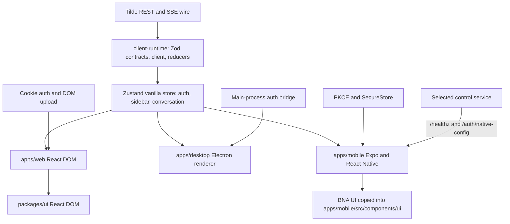

# Intent of the change

- Give Dispatch a second owner client without duplicating chat behavior a third time.
- Move Tilde transport, SSE reconciliation, conversation state, and UI-facing wire types out of the web screen into one framework-neutral package every client consumes.
- Add an Expo iOS and Android client that selects its control service, authenticates with PKCE, and streams conversations.
- Rename `computer-provider` to `computer-service-provider` and remove the `computer-tools` re-export that let callers reach a runtime utility through a provider.
- Record the runtime as mandatory for major UX surfaces, and gate every PR on cross-client parity so a one-client feature cannot ship silently.

# Architecture changes

- `client-runtime` is the only place that parses Tilde wire data, reconciles SSE events, and owns remote snapshots. It imports no React, DOM, Expo, React Native, Electron, or Node API.
- Platform adapters keep what is platform-specific: cookies and DOM upload on web, native credentials behind a narrow bridge on Electron, PKCE and SecureStore on Expo.
- Component layers stay separate. `packages/ui` is React DOM and mobile never imports it; mobile renders BNA UI source copied into the app.
- No new server protocol. Tilde REST and SSE remain the wire authority through the existing allowlisted same-origin bridge.
- One new public route: `GET /auth/native-config`, public, `no-store`, public PKCE metadata only.

# Summarized package changes

- `packages/client-runtime` — new. Grouped Zod contracts by capability (installation, auth, sidebar, messages, events, queue, attachments, platform), REST/SSE client, pure event reducers, Zustand vanilla store.
- `apps/mobile` — new Expo client. Control-service selection, PKCE sign-in, sidebar, streaming chat, send, stop, sign-out. BNA UI components vendored under `src/components/ui` with provenance. `scripts/toolchain.mjs` and `scripts/expo.mjs` resolve the Android SDK and a real Node binary; `scripts/android-emulator.mjs` boots a headless emulator behind Xvfb with loopback VNC.
- `apps/web` — migrated onto the runtime. `src/chat-api.ts` deleted; roughly thirty component-level state variables in `screens/dispatch-app.tsx` replaced by runtime state. New `src/runtime.ts` and `src/web-attachments.ts`.
- `apps/desktop` — consumes shared authentication and preload bridge contracts.
- `apps/control-service` — adds the public `/auth/native-config` endpoint.
- `packages/computer-service-provider` — renamed from `computer-provider`. Root provider API only; `./tools` export and the `@trytilde/dispatch-computer-tools` dependency removed.
- `packages/auth-provider` — native PKCE configuration surfaced for the mobile flow. Merged with PR 45: `registerOwnerAuth` keeps that PR's `OwnerAuthOptions` dev-mode callback handling and gains the `/auth/native-config` route, and the browser E2E auth stub keeps its `redirect_uri` echo alongside the native configuration stub.
- `docs/adrs/0017` — new. ADR-0004, ADR-0010, ADR-0014, ADR-0016 amended.
- `AGENTS.md`, `CONTEXT.md`, `README.md`, `.agents/skills/**` — runtime-mandatory rule, cross-client parity gate in `create-pr`, new `run-expo` skill, vendored `frontend-design`, and the `expo/skills` set tracked in `skills-lock.json`.

# Critical to apply to forks

yes

Two reasons.

**Breaking package rename.** A fork importing `@trytilde/dispatch-computer-provider` will not resolve. Rename the dependency to `@trytilde/dispatch-computer-service-provider` in every `package.json` and import site, including `configuration/index.ts` and any custom provider under `configuration/providers/`. The `./tools` subpath export is gone: import `@trytilde/dispatch-computer-tools` directly wherever a fork reached tools through the provider. Run `pnpm install` and `pnpm check`, then `pnpm build` to confirm no `dist/tools` entry is expected.

**New client boundary.** A fork that customized `apps/web/src/chat-api.ts` or the conversation state in `apps/web/src/screens/dispatch-app.tsx` will conflict: the first file is deleted and the second is largely replaced. Port those customizations into `packages/client-runtime` rather than back into the web screen, because web, Electron, and Expo now share that implementation. A fork adding UI state should read `AGENTS.md` first — network-crossing, persisted, or multi-client state belongs in the runtime; presentation-only state stays in the component.

Forks that only track upstream and do not customize the web client or the computer provider need no action beyond `pnpm install`.
